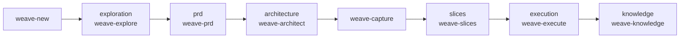
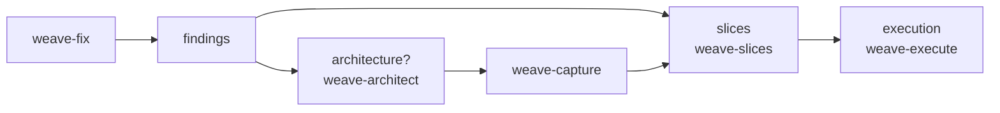

# Weave-It

Weave-It is a TypeScript CLI package. The npm package is `@weave-tools/weave-it` and the CLI binary is `weave`.

## What Is Weave?

Weave is an SDLC tool for AI-assisted software teams. It is designed to work with agents and coding tools like Claude, Codex, OpenCode, and similar systems.

The goal is to give AI tools durable project context across the full software lifecycle:

- Product discovery and requirements
- Engineering planning and implementation
- Cross-repo code exploration
- QA notes, validation, and handoff
- Long-lived product and technical knowledge

Each repo or workspace can contain a committed `wiki/` folder that acts like an LLM-friendly wiki for that context. Weave also maintains committed metadata in `.weave/` and a local session so agents can understand which folders/repos should be considered together for the current task.

## How Weave Works: The Change Lifecycle

Weave organizes work into **changes**: durable folders under `wiki/changes/<change-id>/` on a matching git branch `change/<change-id>`. Each change moves through artifact **lanes** tracked in `status.yml`. Agent **skills** own each lane and write the durable artifacts agents and humans read next.

The active change is **branch-derived**: checking out `change/<change-id>` is how Weave knows which change you are working on. Run `weave change current` to inspect it.

### Stages and owning skills

Lanes can be skipped when a change does not need them. Cross-cutting helpers (`weave-new`, `weave-next`, `weave-capture`, `weave-clarify`) support the flow at any point.

- **exploration** — stress-test product intent, workflows, and edge cases before requirements harden.
  - Skill: `weave-explore` (Plan Mode; read-only interview, no artifact writes)
- **prd** — write or revise user-facing requirements in `prd.md`.
  - Skill: `weave-prd`
- **findings** — capture bug repro, scope, and root-cause notes for fix-type changes in `findings.md`.
  - Skill: `weave-fix` (chat-driven fix entry; also scaffolds an initial slice)
- **architecture** — gather engineering context, tradeoffs, and technical risks; persist design through capture or clarify.
  - Skill: `weave-architect` (Plan Mode; read-only thinking partner, no artifact writes)
- **slices** — scaffold `task-slices/<NN>-<slug>/` folders with slice narrative, contracts, and per-slice `tasks.md`.
  - Skill: `weave-slices`
- **execution** — implement and verify selected tasks locally; update task evidence in `tasks.md`.
  - Skill: `weave-execute` (includes branch prep via `weave task prepare`)
- **knowledge** (cross-cutting) — update current-state specs under `wiki/knowledge/**` and record change-local provenance in `knowledge-delta.md`.
  - Skill: `weave-knowledge`

Helper skills:

- `weave-new` — create a change from a title or topic and recommend the first lane skill.
- `weave-next` — read-only advisory: what skill to run next for the active change.
- `weave-capture` — persist discussion into session notes and/or live artifacts (see [Skills In Depth](#skills-in-depth)).
- `weave-clarify` — focused amendment of one existing artifact when scope or decisions change midstream (see [Skills In Depth](#skills-in-depth)).

### Typical flows

Feature change (`--type feat`, the default):



Fix change (`--type fix`):



Non-feature changes (`refactor`, `docs`, `test`, `ci`, `chore`) start at `stage: started` with no scaffolded artifact. The fitting skill creates the first durable artifact when work is clear enough.

Legacy flat changes with a single change-root `tasks.md` still execute through `weave-execute` in flat mode. New changes should use `weave-slices`. `weave-issues` is superseded by `weave-slices`; `weave-prepare` is deprecated (branch prep is built into `weave-execute`).

## Installation

Install the CLI globally from npm:

```bash
npm install -g @weave-tools/weave-it
```

Then verify it works:

```bash
weave --help
```

Optional: install `codebase-memory-mcp` if you want coding agents to use indexed codebase context while working with Weave-managed repos:

```bash
npm install -g codebase-memory-mcp
```

After installing it, configure or restart your coding agent and index the project. See the [`codebase-memory-mcp` GitHub documentation](https://github.com/DeusData/codebase-memory-mcp) for further setup. Weave works without this MCP; it just gives compatible agents a faster way to search architecture, symbols, and call relationships before reading source files.

## Requirements

- Node.js `>=22.12`
- npm

If you use `nvm`:

```bash
nvm use 22
```

## Setup

Install dependencies from the project root:

```bash
npm install
```

## Development Commands

Run the CLI from source:

```bash
npm run dev -- <command>
```

Examples:

```bash
npm run dev -- --help
npm run dev -- init --help
npm run dev -- init --yes
npm run dev -- workspace --json
```

Typecheck:

```bash
npm run typecheck
```

Run tests:

```bash
npm test
```

Build:

```bash
npm run build
```

Recommended verification before opening a PR:

```bash
npm run typecheck
npm test
npm run build
```

## Test The CLI As `weave`

The package exposes this binary in `package.json`:

```json
"bin": {
  "weave": "./dist/cli.js"
}
```

To test the installed command shape locally:

```bash
npm run build
npm link
```

Then run:

```bash
weave --help
weave init --yes
weave workspace
```

After code changes, run `npm run build` again so the linked command uses the latest compiled output.

To remove the local global link:

```bash
npm unlink -g @weave-tools/weave-it
```

## Supported CLI Commands

## `weave init`

Initializes Weave in **repo mode** or **workspace mode** and starts a local session.

### Repo mode vs workspace mode

| Mode | Use when | Where artifacts live | Sub-repos |
| --- | --- | --- | --- |
| **repo** | Single repo or folder | `wiki/` and `.weave/` inside that repo | Other folders join the ephemeral session via `weave add` |
| **workspace** | Multi-repo product or platform boundary | One shared `wiki/` and `.weave/` at the workspace root | Registered in `.weave/workspace.yml`; implementation happens inside sub-repos |

**Repo mode** is the default. Weave scaffolds `wiki/knowledge/`, `wiki/changes/`, and `.weave/` in the current folder. Each repo keeps its own git history.

**Workspace mode** creates (or adopts into) a workspace whose git repo tracks only the workspace metadata and wiki — not the code inside sub-repos. When you register a sub-repo, Weave appends `/<repo-path>/` to the workspace `.gitignore` so each sub-repo keeps its **independent `.git/` history** and is not nested-committed into the workspace repo. Sub-repo registration and remotes live in `.weave/workspace.yml`.

Common workspace setup paths:

- **From an existing app repo**: Weave creates the workspace beside the repo, moves the repo (including `.git/`) into the workspace, git-ignores it, and registers it in `workspace.yml`.
- **From an empty folder**: the current directory becomes the workspace root; add repos afterward with `weave add`.
- **From outside a git repo**: pass `--workspace-path` to create the workspace at a chosen location.

After workspace-mode init, open the workspace path in your editor. Use `weave add` to register, move, or clone additional repos into the workspace.

```bash
weave init [options]
```

Options:

```text
--id <id>                  folder id
--kind <kind>              folder kind, defaults to app
--mode <mode>              init mode: repo or workspace; defaults to repo with --yes
--workspace-name <name>    workspace name for workspace mode
--workspace-path <path>    workspace path for workspace mode outside a git repo
--yes                      accept defaults and skip prompts
-h, --help                 display help for command
```

Examples:

```bash
weave init --id weave-it --kind package --yes
weave init --mode repo --yes
weave init --mode workspace --workspace-name peoplebox-platform
weave init --mode workspace --workspace-name peoplebox-platform --workspace-path ../peoplebox-platform
```

From source:

```bash
npm run dev -- init --id weave-it --kind package --yes
npm run dev -- init --mode workspace --workspace-name peoplebox-platform
```

## `weave add <path>`

Adds a folder to the current Weave context. Behavior depends on whether the active directory is in **repo mode** or **workspace mode** (detected via `.weave/workspace.yml`).

**Repo mode** (default when no workspace or `mode: repo`):

- Adds the folder to the ephemeral session in `~/.cache/weave/current-session.yml` only.

**Workspace mode** (`mode: workspace` in `.weave/workspace.yml`):

- Accepts a filesystem **path** or a **git URL**.
- **Local path outside the workspace**: moves the folder into the workspace root (including its existing `.git/`) so you **preserve git history**, then registers it in `workspace.yml` and appends it to the workspace `.gitignore`.
- **Local path inside the workspace**: registers in place and gitignores the path.
- **Git URL**: runs `git clone` into the workspace root (directory name from the URL basename), registers the repo, and gitignores the path.
- Records `remote.origin.url` when the folder has a `.git/`.
- Does not add sub-repos to `session.folders`.

### Materializing missing repos

A teammate who clones the workspace sees registered repos in `weave workspace`, including `availability: missing` for gitignored paths not present locally. They can materialize a missing registered repo without rewriting `workspace.yml` or `.gitignore`:

```bash
# Clone by recorded remote
weave add git@github.com:org/billing.git

# Or adopt an existing local checkout (preserves its .git/)
weave add ../billing
```

Both forms recognize when the repo id is already registered but missing locally and place the checkout at the registered path.

```bash
weave add [options] <path-or-url>
```

Arguments:

```text
path-or-url    folder path or git remote URL (workspace mode only for URLs)
```

Options:

```text
--id <id>      folder id (workspace: repos.<id> key; repo mode: session folder id)
--kind <kind>  folder kind, defaults to app
-h, --help     display help for command
```

Examples:

```bash
# Repo mode: add another repo to the local session
weave add ../backend --id backend --kind api

# Workspace mode: register a folder already inside the workspace
weave add ./billing --kind app

# Workspace mode: clone by URL
weave add git@github.com:org/billing.git

# Workspace mode: adopt a sibling repo into the workspace
weave add ../external-tooling
```

From source:

```bash
npm run dev -- add ../backend --id backend --kind api
npm run dev -- add git@github.com:org/billing.git
```

## `weave workspace`

Shows what is around you. Behavior depends on whether the current working directory sits inside a Weave workspace.

```bash
weave workspace [options]
```

Options:

```text
--json      print machine-readable JSON
-h, --help  display help for command
```

`weave workspace` walks up from the current directory looking for `.weave/workspace.yml`:

- **Workspace mode** (a `workspace.yml` with `mode: workspace` is found at or above `cwd`): prints the workspace name, its root path, and the repos registered in `workspace.yml.repos`. An active Weave session is not required.
- **Repo mode** (no workspace.yml above `cwd`, or its `mode` is not `workspace`, or the file is malformed): prints the current Weave session folders. Requires an active session.

Examples:

```bash
weave workspace
weave workspace --json
```

JSON shape in workspace mode:

```json
{
  "session": { "status": "active", "updated_at": "..." } | null,
  "workspace": {
    "name": "peoplebox-platform",
    "path": "/path/to/peoplebox-platform",
    "mode": "workspace"
  },
  "repos": [
    { "id": "billing", "path": "billing", "kind": "app", "remote": "git@github.com:org/billing.git" }
  ],
  "folders": []
}
```

JSON shape in repo mode:

```json
{
  "session": { "status": "active", "updated_at": "..." },
  "workspace": null,
  "repos": [],
  "folders": [
    {
      "id": "frontend",
      "path": "/path/to/frontend",
      "kind": "app",
      "wiki": "/path/to/frontend/wiki",
      "metadata": "/path/to/frontend/.weave"
    }
  ]
}
```

A teammate cloning the workspace fresh can run `weave workspace` immediately from inside the clone to see the registered repos, without ever running `weave init`.

From source:

```bash
npm run dev -- workspace
npm run dev -- workspace --json
```

## `weave change`

Creates, inspects, and switches durable change folders under `wiki/changes/`.

```bash
weave change new "<title>" [options]
weave change list [options]
weave change current [options]
weave change status [change] [options]
weave change progress <lane> [options]
weave change clear-stale <lane> [options]
weave change switch <change> [options]
weave change knowledge <status> [options]
```

`weave change new` creates a change id in the form `{YYMMDD}-{XXXX}-{slug}`, writes `status.yml`, creates or checks out the matching git branch, and scaffolds the first artifact when applicable:

```text
change/{change-id}
```

- `--type feat` (default): scaffolds `exploration.md` and starts at `stage: exploration`.
- Non-feature types (`fix`, `refactor`, `docs`, `test`, `ci`, `chore`): start at `stage: started` with no scaffolded artifact.

The active change is **branch-derived**: checking out `change/<change-id>` is authoritative. Weave does not write active-change routing into committed files.

Change commands are **cwd-dispatched**. Weave walks up from the current directory to `.weave/workspace.yml`; in workspace mode the workspace root owns `wiki/changes/`, and in repo mode the repo root owns `wiki/changes/`. Running from a nested workspace repo or repo subdirectory operates on that containing Weave root.

Options for `new`:

```text
--type <type>          change type: feat, fix, refactor, docs, test, ci, or chore; defaults to feat
--slug <slug>          change slug override
--json                 print machine-readable JSON
```

Options for `list`, `current`, `status`, and `switch`:

```text
--json                 print machine-readable JSON
```

Options for `progress`:

```text
lane                  exploration, prd, findings, architecture, or slices (issues accepted as alias for slices)
--source <source>     repeatable source dependency: exploration, prd, findings, architecture, discussion, sessions, or codebase
--no-invalidate       suppress all downstream stale propagation for this call
--invalidate <list>   mark only this comma-separated subset of dependent lanes stale (e.g. slices,architecture)
--json                print machine-readable JSON
```

Options for `clear-stale`:

```text
lane                  exploration, prd, findings, architecture, or slices
--reason <reason>     one-sentence verification rationale recorded in stale_history
--json                print machine-readable JSON
```

Examples:

```bash
weave change new "Analytics of reviews"
weave change new "Fix review import" --type fix --slug review-import
weave change list
weave change current
weave change status
weave change progress prd --source exploration --source sessions --json
weave change status 260522-f3q9-review-analytics
weave change switch f3q9
```

From source:

```bash
npm run dev -- change new "Analytics of reviews"
```

`weave change list` is a clean index and marks the active change with `*`. `weave change current` shows the active change from the checked-out branch. `weave change status` reports metadata and branch alignment. `weave change switch` is the explicit way to move to another existing change.

`weave change progress <lane>` records lifecycle progress for the active change. `stage` is orientation for the furthest progressed lane; it does not prove skipped upstream artifacts were created. `artifacts` records the source graph used for stale invalidation:

```yaml
stage: architecture
artifacts:
  prd:
    sources:
      - exploration
      - sessions
    updated_at: "2026-05-31T04:00:00.000Z"
  architecture:
    sources:
      - prd
      - codebase
    updated_at: "2026-05-31T04:05:00.000Z"
```

Pass each source with repeatable `--source` flags. Source lists are replaced on each progress call for that lane.

`stale` records source-aware dependents that should be refreshed after a source lane changes:

```yaml
stage: slices
stale:
  architecture:
    invalidated_by: prd
    invalidated_at: "2026-05-31T04:06:16.000Z"
```

Weave-managed artifact-writing skills call `progress` after successful live artifact writes. Existing changes without `artifacts` or `stale` continue to work and are treated as having no recorded dependencies or stale lanes.

Default propagation marks every transitive downstream lane stale. Skills following the **Lifecycle Staleness Verification Protocol** (embedded in `weave-prd`, `weave-clarify`, `weave-slices`, and `weave-capture`) first read the dependent artifacts and decide per-lane whether the upstream change actually invalidates them:

```bash
# default: every downstream lane goes stale
weave change progress prd --source exploration --json

# narrow clarification, no dependent invalidated
weave change progress prd --source exploration --no-invalidate --json

# only `slices` is invalidated, not `architecture`
weave change progress prd --source exploration --invalidate=slices --json
```

If a previously-stale lane is now in content sync (verified by reading both artifacts), clear the flag with an audit-trail entry:

```bash
weave change clear-stale architecture --reason "Wording typo in prd; architecture references unchanged" --json
```

Each clear appends a record to `status.yml.stale_history` with `lane`, `invalidated_by`, `invalidated_at`, `cleared_at`, and `reason`. Never hand-edit `status.yml` to change stale state; use the CLI.

If a target is not a git repo, Weave still writes the change artifacts and reports branch creation as skipped. `switch` blocks when affected git repos have uncommitted changes; `new` does not block so already-started local work can be captured as a new change.

## `weave status`

Shows the installed `@weave-tools/weave-it` package version, the bundled skill versions, and any notices for the current repo.

```bash
weave status [options]
```

Options:

```text
--json      print machine-readable JSON
-h, --help  display help for command
```

`weave status` is the explicit, detailed view of:

- the installed `@weave-tools/weave-it` npm package version,
- the latest cached `@weave-tools/weave-it` version from the npm registry (refreshed at most once every 24h),
- every installed skill, the package version it was installed from, the current bundled package version, and a per-skill state (`current`, `outdated`, `modified`, `missing`),
- the same `notices` array that Tier 1 commands return in `--json` mode.

Use it whenever a notice points you here:

```bash
weave status
weave status --json
```

## `weave doctor`

Inspects the current Weave project and optionally repairs missing safe scaffold files.

```bash
weave doctor [options]
```

Options:

```text
--fix       create missing safe scaffold files without overwriting existing files
--json      print machine-readable JSON
-h, --help  display help for command
```

`weave doctor` is read-only by default. It reports metadata health, missing safe scaffold files, installed skill drift, active change context, branch match status when available, and a summary status of `ok`, `warning`, or `error`.

`weave doctor --fix` is intentionally narrow. It only creates missing safe scaffold directories and files through write-if-missing behavior, such as `.weave/architecture-considerations.md` and standard `wiki/knowledge/**` scaffold files. It never overwrites existing files, updates installed skills, changes branches, edits `status.yml`, mutates live artifacts, or runs migrations.

Examples:

```bash
weave doctor
weave doctor --json
weave doctor --fix
weave doctor --fix --json
```

Existing Weave projects can run `weave doctor --fix` after upgrading the package to receive newly-added safe scaffold files without restarting sessions or running `weave init` again.

## Notices

The Tier 1 commands surface a stable `notices` array in their `--json` output and, in interactive TTY mode, print a one-line stderr footer that tells the user there are notices and to run `weave status`:

```text
weave workspace
weave change current
weave change status
weave change new
weave status
weave doctor
```

Notice kinds:

```text
package_outdated   a newer @weave-tools/weave-it npm version is cached locally
skills_modified    one or more installed SKILL.md files differ from the manifest hash
skills_outdated    one or more installed skills were installed from an older @weave-tools/weave-it version than the current bundled skills
```

Notices are computed in parallel with the command's normal work; missing network, an unwritable `~/.weave/cache`, or a stripped-down npm registry response all degrade gracefully to an empty array.

Suppress notices everywhere with either:

```bash
NO_UPDATE_NOTIFIER=1 weave change current
WEAVE_NO_NOTICES=1 weave change current
```

Non-Tier-1 commands (`agent install`, `agent update`, `change list`, `change progress`, etc.) never include a `notices` field.

## Skill Versioning

Every bundled `SKILL.md` template carries a `last_changed_in` frontmatter field recording the `@weave-tools/weave-it` package version of the last substantive change to that skill:

```yaml
---
name: weave-prd
description: Generate or revise prd.md ...
last_changed_in: 0.1.0
---
```

When a skill is installed, the version is stamped into `.weave/agents.yml` as `installed_from`. The `skills_outdated` notice fires when the bundled version is newer than the recorded `installed_from`. Run `weave agent update <agent>` to bring untouched skills up to date, or `weave agent reset <agent> <skill>` to overwrite a locally-modified copy.

Maintainers bump `last_changed_in` for every skill that changed since the previous git tag with:

```bash
npm run release:bump-skills
```

The script reads `package.json`'s `version`, diffs each `templates/skills/<name>/SKILL.md` against the most recent reachable git tag, and only updates skills with real changes. It never commits or tags on its own.

## Plan Mode Guard (design-discussion skills)

`weave-explore` and `weave-architect` ship with an embedded **Plan Mode Guard** because supported agent harnesses block filesystem writes in plan mode / ask mode:

- The skill refuses entry when the harness is not in Plan Mode: `This skill must run in Plan Mode. Switch to Plan Mode, then invoke <skill-name> again.`
- In Plan Mode the skill resolves the branch-derived active change and treats its lane (`exploration` or `architecture`) as the target without writing repo-tracked artifacts.
- Durable artifact writes happen later through `weave-capture` (after design discussion) or structural changes through `weave-clarify`.

`weave-prd` and `weave-clarify` run in Agent Mode and write artifacts directly. They do not carry the guard.

The guard text is enforced byte-identically across the two skills by a test against the canonical constant in `src/lib/skill-template-checks.ts`.

## `weave agent`

Installs and manages Weave Agent Skills for supported coding agents.

```bash
weave agent <install|update|diff|reset> <agent> [skill]
```

Agents:

```text
codex      install Agent Skills to .agents/skills
cursor     install Agent Skills to .agents/skills
claude     install Agent Skills to .claude/skills
opencode   install Agent Skills to .agents/skills and slash commands to .opencode/commands
all        install every supported integration
```

Examples:

```bash
weave agent install opencode
weave agent update opencode
weave agent diff opencode weave-explore
weave agent reset opencode weave-explore
```

`install` and `update` protect user edits. They update files only when the current file still matches the last Weave-installed hash in `.weave/agents.yml`. If a user edits an installed skill or command wrapper, Weave skips it. `reset` is the explicit overwrite path.

## Skills In Depth

Weave ships Agent Skills for the full change lifecycle. Each skill starts by running `weave workspace --json` and uses `wiki/knowledge/**` plus `wiki/changes/**` as durable context.

### Skill reference

```text
weave-new        start a new change from a title or topic
weave-capture    capture discussion into session notes and/or live artifacts
weave-explore    stress-test product requirements (Plan Mode; read-only)
weave-prd        generate or revise prd.md
weave-architect  engineering thinking partner (Plan Mode; read-only)
weave-clarify    amend one existing artifact when scope or decisions change
weave-fix        chat-driven fix entry; writes findings.md + initial slice
weave-slices     scaffold task-slices/ from upstream artifacts
weave-execute    implement and verify selected tasks locally
weave-next       read-only: recommend the next skill for the active change
weave-knowledge  update current-state knowledge specs for an active change

Legacy / deprecated:
weave-issues     superseded by weave-slices (flat tasks.md only)
weave-prepare    deprecated; branch prep is built into weave-execute
```

### `weave-capture`

`weave-capture` is the primary way to persist design discussion without storing a raw transcript. It runs in two modes:

- **Artifact capture** (bare `weave-capture`): writes a structured session note under `wiki/changes/<id>/sessions/`, promotes pending session-only context for the selected lane, and merges durable content into the live artifact (`exploration.md`, `prd.md`, legacy `architecture.md`, or folder-mode `architecture/index.md` plus facets). Calls `weave change progress <lane>` after a successful write.
- **Session-only capture** (`weave-capture session [exploration|prd|architecture]`): writes a lane-aware session note only; never updates live artifacts or calls lifecycle progress.

Before any write, **Defensive Lane Verification** compares the resolved lane against the dominant subject of the conversation. When they clearly disagree, capture stops and asks you to confirm the lane. The skill never silently overrides an explicit selection.

`weave-capture` is the only v1 flow that promotes pending session-only context into live artifacts. Downstream skills treat live artifacts as canonical; they do not scan pending session notes before running.

### `weave-clarify`

`weave-clarify` refines **one existing artifact** when scope, requirements, assumptions, or decisions change midstream. It is not a generation skill: it does not create a new change, write a PRD from scratch, or generate architecture from scratch.

- Targets: `exploration`, `prd`, or `architecture` (legacy file mode or folder-mode facets).
- Updates only the selected lane and reports follow-up lanes that need separate clarification.
- For architecture, supports structural operations: create/split/merge/rename/delete facets and migrate legacy `architecture.md` to folder mode when explicitly requested.
- In workspace mode, may inspect registered sub-repos only when the selected clarification depends on repo-local truth.
- Applies the Lifecycle Staleness Verification Protocol before calling `weave change progress <target>`.

Use `weave-explore` / `weave-architect` for initial design thinking, `weave-capture` to persist architecture discussions, and `weave-clarify` for focused amendments.

### Other skills (concise)

- **`weave-new`**: creates a change via `weave change new` and recommends the first lane skill (`weave-explore` for features; `weave-fix` / `weave-architect` / `weave-slices` / `weave-prd` for non-feature types).
- **`weave-explore`**: Plan Mode product discovery; interviews and stress-tests requirements without writing artifacts.
- **`weave-prd`**: writes or revises `prd.md` from exploration and session context.
- **`weave-architect`**: Plan Mode read-only engineering partner; gathers context and returns architecture dissection in chat. Durable architecture writes happen through `weave-capture` or `weave-clarify`.
- **`weave-fix`**: chat-driven `--type fix` entry; writes `findings.md`, scaffolds `task-slices/01-<slug>/`, progresses the `findings` lane.
- **`weave-slices`**: scaffolds `task-slices/<NN>-<slug>/` from upstream artifacts; owns the `slices` lane; requires explicit verification tasks per slice.
- **`weave-execute`**: agent-first local task execution in slice mode (`/weave-execute 01 T1`) or flat legacy mode (`/weave-execute T3`); includes branch prep, dependency expansion, verification, and narrow `tasks.md` evidence updates. Does not commit, push, or open PRs.
- **`weave-next`**: read-only advisory summary of artifact state and recommended next skill.
- **`weave-knowledge`**: updates `wiki/knowledge/**` and writes `knowledge-delta.md` for the active change.

Every bundled skill follows the shared `# Silent Weave Command Output` contract: discovery command output is internal by default; only blockers, failures, relevant notices, or user-required actions are summarized.

Install skills for one agent:

```bash
weave agent install claude
weave agent install cursor
weave agent install codex
weave agent install opencode
weave agent install all
```

New skills such as `weave-slices`, `weave-fix`, and `weave-execute` require `weave agent install`; `weave agent update` refreshes existing manifest entries only.

Install targets:

```text
claude     .claude/skills/<skill>/SKILL.md
cursor     .agents/skills/<skill>/SKILL.md
codex      .agents/skills/<skill>/SKILL.md
opencode   .agents/skills/<skill>/SKILL.md
opencode   .opencode/commands/<skill>.md
```

### Invoking skills by agent

Claude Code, Cursor, and opencode use slash commands; Codex uses `$`-prefixed skill names.

```text
/weave-new "Analytics of reviews"
/weave-fix "Review import fails on large CSV"
/weave-capture
/weave-capture session prd
/weave-explore "Analytics of reviews"
/weave-prd
/weave-architect
/weave-clarify prd
/weave-slices
/weave-execute 01 T1
/weave-next
/weave-knowledge
```

Or invoke naturally:

```text
Use the weave-explore skill for Analytics of reviews.
Use the weave-capture skill to capture this session without updating artifacts.
Use the weave-slices skill to scaffold task slices from the active PRD.
Use the weave-execute skill to implement slice 01 task T1.
Use the weave-clarify skill to revise the active PRD after scope changes.
```

Knowledge freshness is tracked through the CLI:

```bash
weave change knowledge pending --reason "Knowledge impact not resolved yet"
weave change knowledge updated --domain performance-reviews --file wiki/knowledge/domains/performance-reviews/domain-wide/approvals.md --delta wiki/changes/<change-id>/knowledge-delta.md --reason "Updated current approval behavior"
weave change knowledge none --delta wiki/changes/<change-id>/knowledge-delta.md --reason "No durable behavior impact"
weave change knowledge stale --invalidated-by prd --reason "PRD changed after knowledge was updated"
```

The standard knowledge structure is scaffolded progressively:

```text
wiki/knowledge/
  index.md
  README.md
  domains/
    README.md
    <domain>/
      index.md
      features/<feature>/behavior.md
      domain-wide/
  shared/
    README.md
    <shared-behavior>/behavior.md
.weave/
  architecture-considerations.md
```

V1 provides scaffold/docs guidance and skill contract tests for this structure. It does not add a CLI validation command for knowledge folders.

## `weave skills` and `weave skill`

Lists and prints bundled Weave skills.

```bash
weave skills list
weave skill show weave-new
weave skill show weave-capture
weave skill show weave-explore
weave skill show weave-prd
weave skill show weave-architect
weave skill show weave-clarify
weave skill show weave-fix
weave skill show weave-slices
weave skill show weave-execute
weave skill show weave-next
weave skill show weave-knowledge
```

## Project Structure

```text
src/
  cli.ts
  commands/
    add.ts
    agent.ts
    change.ts
    doctor.ts
    init.ts
    skills.ts
    slice.ts
    status.ts
    task.ts
    workspace.ts
  lib/
    add-folder.ts
    agent-skills.ts
    architecture-artifact.ts
    changes.ts
    doctor.ts
    files.ts
    folders.ts
    git.ts
    ids.ts
    init-workspace.ts
    notices.ts
    session-state.ts
    show-workspace.ts
    skill-template-checks.ts
    sliceRollup.ts
    sync.ts
    task-prepare.ts
    tasks.ts
    weave-scaffold.ts
    workspace-mode.ts
    workspace-repos.ts
templates/
  opencode/
    commands/
  skills/
tests/
  agent-skills.test.ts
  cli-doctor.test.ts
  cli-skills.test.ts
  changes.test.ts
  init.test.ts
  slice-rollup.test.ts
  task-prepare.test.ts
.weave/
  agents.yml
  architecture-considerations.md
  sync.yml
  workspace.yml
wiki/
  knowledge/
  changes/
```

## Contribution Notes

- Keep changes small and focused.
- Add or update tests for behavior changes.
- Do not commit `node_modules/`, `dist/`, coverage output, or local machine state.
- Source files use ESM imports with `.js` specifiers because TypeScript is configured with `NodeNext` module resolution.
- Use `apply_patch` or normal editor changes for source edits, then run typecheck, tests, and build.

## Releasing

Releases are cut manually by a maintainer with npm publish access and push access to the repo. Each release is a single `npm version` bump that also stamps skill versions, followed by a push and publish.

1. Ensure the working tree is clean and all prep is committed.
2. Choose the bump level and create the version commit and tag in one step. The committed `.npmrc` (`tag-version-prefix=""`) produces bare-number tags such as `1.0.0`, not `v1.0.0`:

```bash
npm version <patch|minor|major> --message "release: %s"
```

   This bumps `version` in `package.json`, runs the `version` lifecycle hook (which stamps `last_changed_in` on every skill changed since the previous tag and stages `templates/skills`), creates one commit `release: <version>`, and creates the matching bare git tag.

3. Push the commit and the tag:

```bash
git push --follow-tags
```

4. Publish to npm. The `prepublishOnly` hook runs typecheck, tests, and build before anything is uploaded, so a failing gate aborts the publish:

```bash
npm publish
```

5. Verify the release:

```bash
npm view @weave-tools/weave-it
npm install -g @weave-tools/weave-it && weave --help
```

6. Optionally refresh this clone's own installed skill copies so local dogfooding matches what shipped:

```bash
weave agent update --all
```

## License

This project is licensed under the MIT License. See [LICENSE](./LICENSE) for the full text.
