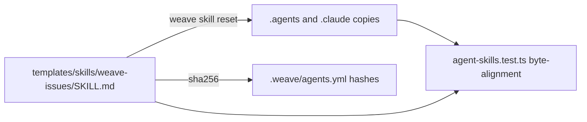

# Categorized `tasks.md` For weave-issues Architecture

## Summary

This change extends the `weave-issues` skill so that, within an active change, discovered in-flight work is recorded in the category-appropriate section of `tasks.md`. `T#` implementation tasks remain the backbone. Two flat sibling sections are added: `QA Findings` (`QF#`) for defects observed during the change, and `Refactors` (`R#`) for structural cleanup that must not change observable behavior.

The affected systems are entirely skill-content and test surfaces. The implementation strategy is to edit one canonical skill template, propagate byte-identical copies to the installed agent directories via the existing CLI, and update the skill contract tests. No CLI/runtime code, no new lifecycle lane, and no new lifecycle source IDs are required.

The main constraint is that installed skill copies must remain byte-identical to the canonical template, which the test suite enforces.

## PRD Context

- PRD path: `wiki/changes/260602-of9s-add-ability-to-bug-fix/prd.md`
- Product goals supported: section selection driven by work-item category (not change type); a dedicated `QA Findings` (`QF#`) section and a dedicated `Refactors` (`R#`) section; observation-style refactors that can be logged-but-deferred; append-first, preview-before-write, stable-ID reconciliation extended to `QF#`/`R#`; optional `Origin`/`Related finding` links on `T#` tasks; no special refactor routing.
- Product non-goals that affect the design: no new artifact type, no new dedicated bug/refactor skill, no external issue-tracker integration, no parent/child change model.
- Product ambiguities that matter technically: none blocking. The PRD fully specifies section shapes, statuses, and acceptance criteria as of the 2026-06-03 clarification.

## Current System

- `weave-issues` writes a single canonical `tasks.md` shape defined by the `<tasks-template>` block in `templates/skills/weave-issues/SKILL.md`: frontmatter, `Source Context`, `Local Tracking Status`, `Status Legend`, `Active Task Index`, `T#` details, `Invalid Tasks` (defaults to `None.`), and `Verification`.
- Skill distribution is template-plus-copies. The canonical source is `templates/skills/weave-issues/SKILL.md`. Installed copies live at `.agents/skills/weave-issues/SKILL.md` (codex and cursor), `.claude/skills/weave-issues/SKILL.md` (claude), and the opencode wrapper at `.opencode/commands/weave-issues.md`.
- Propagation is hash-based in `src/lib/agent-skills.ts`. `installAgentSkills`/`updateAgentSkills` rewrite a copy only when its current sha256 still equals the recorded `installed_hash`; `resetAgentSkills` force-writes. `.weave/agents.yml` records `source_hash` and `installed_hash` per agent and artifact.
- Test coverage in the touched area: `tests/agent-skills.test.ts` asserts (a) the `.agents` and `.claude` copies equal the template byte-for-byte, (b) specific `toContain` strings on the installed `weave-issues` copy, and (c) the default-skill metadata including a description containing `"local implementation tasks"`.
- Lifecycle: the `issues` lane and the source IDs `exploration`, `prd`, `architecture`, `discussion`, `sessions`, `codebase` already exist. No schema change is needed.

## Proposed Architecture

Systems and modules to change:

- `templates/skills/weave-issues/SKILL.md` (the only real source edit):
  - Add a classification rule in the drafting flow: a defect becomes a `QF#`, structural cleanup with no observable behavior change becomes an `R#`, everything else is a `T#` task (optionally tagged).
  - Extend the `<tasks-template>` block, keeping `T#` as the backbone and adding two flat sibling sections after the `T#` details and before `Invalid Tasks`:
    - `## QA Findings`: finding status legend (`new`, `accepted`, `fixed`, `verified`, `duplicate`, `not_reproducible`, `out_of_scope`, `invalid`); index columns ID, Status, Severity, Source, Related Task, Summary; `### QF#` fields Observed behavior, Expected behavior, Reproduction, Severity, Source, Artifact impact, Related tasks.
    - `## Refactors`: refactor status legend (`proposed`, `accepted`, `deferred`, `done`, `out_of_scope`, `invalid`); index columns ID, Status, Scope, Related Tasks, Summary; `### R#` fields Motivation, Scope / affected modules, Behavior preservation, Risk / blast radius, Regression verification, Related tasks.
  - Both new sections default to `None.`, mirroring the existing `Invalid Tasks` convention, so every `tasks.md` keeps a stable structure.
  - Add optional `Origin:` (`qa_finding`/`refactor`) and `Related finding:` (`QF#`/`R#`) fields to the `T#` detail shape.
  - Extend reconciliation rules so append-first, preview-before-write, and stable-ID handling explicitly apply to `QF#` and `R#`, with independent ID namespaces and no reuse of invalidated IDs. A deferred `R#` may exist without a `T#`.
  - State that there is no special refactor routing or escalation; the user decides.
- Installed copies are regenerated, not hand-edited.

Data ownership and lifecycle: `tasks.md` remains a local, change-scoped artifact owned by `weave-issues`. The `issues` lane and existing source IDs are reused unchanged.

Configuration changes: `.weave/agents.yml` hashes for `weave-issues` are refreshed by the propagation command.

## Data Flow

The author edits the canonical template. The CLI copies it byte-for-byte into each installed agent directory and records the new sha256 in the manifest. The test suite then verifies the installed copies match the template and contain the expected structural anchors.

At runtime, `weave-issues` classifies each discovered work item and writes it into the matching `tasks.md` section, then records `weave change progress issues` with the sources that informed the file.

## Architecture Decisions

- Decision: section selection in `tasks.md` is driven by the category of each work item, not the change's declared `type`. Rationale: matches the product intent that in-flight work be categorized regardless of the overall change type. Consequence: `T#` stays the backbone and the same template serves all change types.
- Decision: the new `QA Findings` and `Refactors` sections are always present with `None.` defaults. Rationale: mirrors the existing `Invalid Tasks` convention and keeps a stable, diff-friendly structure. Consequence: every generated `tasks.md` carries both sections even when empty.
- Decision: reuse the existing `issues` lane and source IDs. Rationale: no lifecycle semantics change. Consequence: no CLI or schema work.
- Decision: propagate via `weave skill reset weave-issues --agent all`. Rationale: deterministic force-write that refreshes manifest hashes and guarantees byte alignment. Consequence: installed copies are never hand-edited.

## Rejected Alternatives

- Conditional sections that appear only when populated. Rejected for v1 in favor of stable always-present structure consistent with `Invalid Tasks`. May become viable if `tasks.md` size becomes a concern.
- Hand-editing each installed copy. Rejected as drift-prone and bypassing the manifest hash flow.
- Modeling categories as a `T#` `Origin` tag only, without `QF#`/`R#` sections. Rejected during exploration because discovered work must stay distinct from planned tasks.
- A change-type-driven template (Model A). Rejected during exploration; overall type is handled upstream by `weave-architect`/`weave-prd`.

## Constraints and Tradeoffs

- Repo convention: installed skill copies must be byte-identical to the canonical template; enforced by `tests/agent-skills.test.ts`.
- Compatibility: existing `tasks.md` files remain valid. Reruns reconcile rather than rewrite; new sections are additive.
- Delivery sequencing: edit template first, then propagate, then update tests; the byte-alignment test will fail until propagation runs.
- Operational simplicity: no runtime, migration, or data changes; the cost is concentrated in careful markdown structure and test anchors.

## Integration Points

- CLI: `weave skill reset`/`weave skill update` (from `src/commands/skills.ts` via `src/lib/agent-skills.ts`) for propagation.
- Manifest: `.weave/agents.yml` for installed-copy hashes.
- Lifecycle: `weave change progress issues --source ...` for the `issues` lane.
- No external services, queues, or file-format integrations are involved.

## Rollout and Migration

- No feature flags or config gates.
- No migration or backfill; existing change folders and `tasks.md` files are untouched until a `weave-issues` rerun.
- Rollback is a `git revert` of the template, propagation, and test edits.
- User communication: README note that `weave-issues` now records QA findings and refactors as categorized sections.

## Observability and Operations

- Not applicable as a runtime system. Operational verification is the test suite plus a manual `weave-issues` smoke run.
- Failure modes are limited to drift between template and installed copies, surfaced by the alignment test and by `weave skill diff`.

## Testing Strategy

- Unit/contract: extend `tests/agent-skills.test.ts` with `toContain` assertions for stable structural anchors (`## QA Findings`, `## Refactors`, the `QF#`/`R#` status legends, the classification sentence). Keep assertions on headings and status tokens rather than prose.
- Alignment: the existing byte-equality test (`tests/agent-skills.test.ts:211-212`) covers the installed copies once propagation runs.
- Build/type: `npm run typecheck` and `npm run build` for safety, though no TypeScript changes are expected.
- Manual: rerun `weave-issues` against this change and confirm `tasks.md` renders both sections with `None.` defaults.

## Security and Data Integrity

- No authorization boundaries, sensitive data, or persistence changes. `tasks.md` stays local and human-edited. Append-first and stable-ID rules protect prior findings/tasks from accidental rewrites.

## Implementation Risks

- Risk: installed copies drift from the template. Impact: alignment test fails. Mitigation: always propagate via `weave skill reset`; never hand-edit copies.
- Risk: stale `.weave/agents.yml` hashes. Impact: confusing `weave skill update` status later. Mitigation: `reset` refreshes hashes.
- Risk: brittle test string assertions. Impact: false failures on minor wording changes. Mitigation: assert on stable structural anchors, not prose.

## Assumptions

- The opencode wrapper (`templates/opencode/commands/weave-issues.md`) needs no change; it is a generic "Load and follow" wrapper.
- The frontmatter `description` can stay as-is (the metadata test uses `stringContaining("local implementation tasks")`); an optional tweak to mention findings/refactors is safe.
- No external issue-tracker integration is added.

## Open Technical Questions

- None blocking. Optional: whether to tweak the frontmatter `description` to mention findings/refactors.

## Product Questions Raised by Technical Design

None.

## Revision History

- 2026-06-03: Initial architecture generated from `prd.md` and codebase review (template-plus-copies propagation model, categorized `tasks.md` sections, test strategy).
