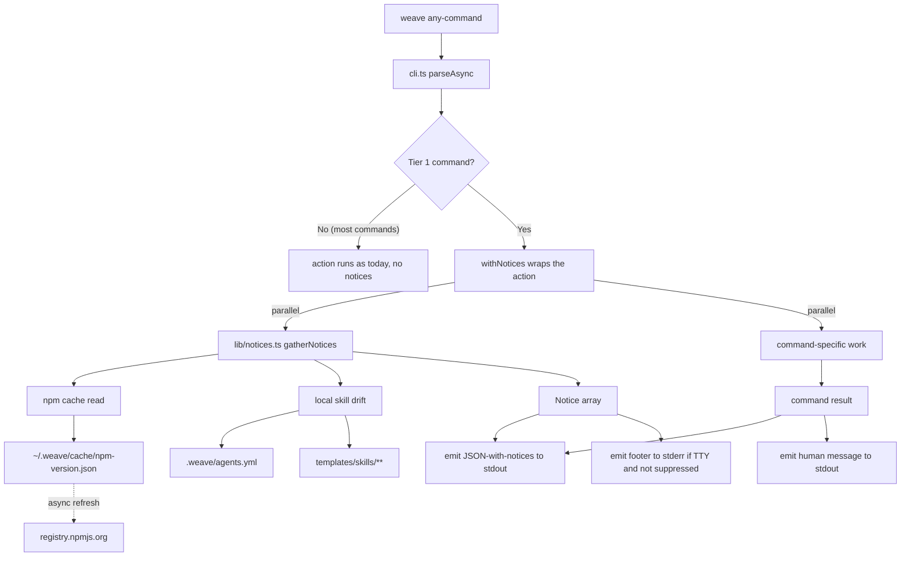

# Npm And Skill Versioning And Updates Architecture

## Summary

The PRD requires six cooperating product surfaces: a `last_changed_in` skill version field, a passive stderr footer (Tier 1 only), a stable `--json notices` contract (Tier 1 only), a new read-only `weave status` command, a **Design-Skill Artifact Context Protocol** (Plan Mode Protocol) that makes design-discussion skills produce reliable lane state across all four agents regardless of host mode, and a **Lifecycle Staleness Verification Protocol** that lets the agent suppress false-positive stale flags when artifacts are actually in content sync. The architecture realises this with six layered systems on top of the existing Weave CLI:

1. **Versioned skill metadata** - a new `last_changed_in: <package-version>` frontmatter field on every bundled `SKILL.md`, plus a new `installed_from: string | null` field per skill in `.weave/agents.yml`. A release-time script bumps the source-side field by diffing `templates/skills/**` against the previously published tag.
2. **Tier 1 notice surfacing** - a narrow `lib/with-notices.ts` helper wired into exactly five entry-point commands (`weave workspace`, `weave change current`, `weave change status`, `weave change new`, and the new `weave status`). Every other command remains unchanged. This preserves the AI-agent surfacing path (every shipped skill's discovery phase calls `weave workspace --json` and/or `weave change current --json`, both Tier 1) and the human anchor moment (`weave change new`) without paying for a universal central-renderer refactor across all ~15 action handlers.
3. **Notice generation** - a new pure module `lib/notices.ts` that gathers `Notice[]` from local skill drift (manifest vs bundled templates) and the npm version cache. Reused by both `withNotices` and `weave status`.
4. **Cached HTTPS npm version check** - a new `lib/npm-version.ts` using Node 22's built-in `fetch` with a 3-second `AbortController` timeout, plus `lib/user-paths.ts` for the user-level cache file at `~/.weave/cache/npm-version.json`. Cache TTL is 24 hours; first-run is fire-and-forget background fetch.
5. **Design-Skill Plan Mode Protocol** - a two-phase protocol embedded as byte-identical text in `templates/skills/<name>/SKILL.md` for the four design-discussion skills (`weave-explore`, `weave-prd`, `weave-architect`, `weave-clarify`), enforced by a CI test against a shared canonical constant. Companion defensive behavior in `weave-capture` (also a SKILL.md edit) handles the case where the user invokes capture before the deferred mutation runs. No new runtime code; the entire protocol is enforced via skill-template text and tests. Uses the same `src/lib/skill-template-checks.ts` helper introduced for the `# Surface Weave Notices` boilerplate (Architecture Decision #10), with a second exported constant `EXPECTED_PLAN_MODE_PROTOCOL`.
6. **Lifecycle Staleness Verification Protocol** - a three-layer fix for the lifecycle model's content-blind pessimistic staleness propagation. Layer 1: a byte-identical SKILL.md verification block in the five skills that call `weave change progress` (`weave-explore`, `weave-prd`, `weave-architect`, `weave-clarify`, `weave-capture`), enforced via the third canonical constant `EXPECTED_LIFECYCLE_SYNC_PROTOCOL` exported from the same `src/lib/skill-template-checks.ts` helper. Layer 2: three small additive CLI levers on `weave change progress` (`--no-invalidate`, `--invalidate=<lane>,<lane>`) and one new sibling command (`weave change clear-stale <lane>`) implemented in `src/lib/changes.ts` and `src/commands/change.ts`. Layer 3: a one-sentence clarification in skill text that `--source` semantics are causal influence, not strict-DAG dependency (so the verification protocol — not a CLI-imposed DAG constraint — is the mechanism that handles false-positive stale flags).

The main constraints shaping the design are: zero new runtime dependencies, no programmatic invocation of `npm i -g`, machine-readable output must not be corrupted in CI or agent contexts, the existing hash-based local-edit detection must continue to work unchanged, skill behavior across all four agents must stay byte-identical for the shared boilerplate and protocol blocks, and the existing pessimistic default behavior of `weave change progress` must be preserved exactly when no new flag is passed (the new levers are opt-in additive).

## PRD Context

- PRD path: [wiki/changes/260603-piln-npm-and-skill-versioning-and-updates/prd.md](wiki/changes/260603-piln-npm-and-skill-versioning-and-updates/prd.md).
- Product goals this architecture supports: detect newer `weave-it` on npm; detect stale skills in repo; deliver notices to both human terminal users and AI agents without corrupting JSON; single read-only `weave status` as the remediation locus; per-skill version metadata; never invoke `npm i -g`; agent-context staleness as a first-class surface; reliable design-discussion skill lane state across all four agents regardless of host mode (added 2026-06-03 via `weave-clarify prd`); content-aware staleness suppression via an agent verification protocol plus CLI levers, so users do not see false-positive stale flags when artifacts are actually in sync (added 2026-06-03 via `weave-clarify prd`).
- Product non-goals that affect the design: no independent per-skill semver, no auto-merge of modified+stale skills, no pre-release dist-tag tracking in v1, no telemetry, no general changelog viewer, no per-agent branching in the Plan Mode Protocol (uniform across all four), no auto-recovery when a user skips the post-acceptance directive of the protocol, no strict-DAG validation on `weave change progress --source` (Fix A rejected; `sources` semantics remain causal influence), no content-aware staleness detection inside the CLI (the agent makes that judgement, the CLI provides levers), no hash-based artifact tracking, no auto-clear of stale flags as a side effect of any progress call, no global "always pessimistic" override (default behavior already is pessimistic when the new levers are not used).
- Product assumptions that matter technically: users primarily install `weave-it` globally via npm; the four supported agents (claude, cursor, codex, opencode) are the v1 set; bundled skills only grow release over release; every supported agent harness blocks filesystem-write tool calls uniformly in plan/ask/read-only modes; a skill's discovery phase calls at least one Tier 1 command; LLM agents can reliably perform semantic content-sync judgement between two related artifacts (artifacts are typically <1000 lines and already in the LLM's context); the existing pessimistic default of `weave change progress` is preserved when neither `--no-invalidate` nor `--invalidate` is passed.
- The PRD's universal `--json notices` over-scoping (previously flagged here as an open product question) was resolved upstream by `weave-clarify prd` on 2026-06-03; the Tier 1 set is now PRD-locked. The PRD added two co-requirement sections, `Design-Skill Artifact Context Protocol` and `Lifecycle Staleness Verification Protocol`, both of which this architecture realises (see `Proposed Architecture > Design-Skill Plan Mode Protocol`, `Proposed Architecture > Lifecycle Staleness Verification`, and Architecture Decisions #12 and #13).

## Current System

- [src/cli.ts](src/cli.ts) is a 33-line commander assembly. It registers eight top-level commands (`init`, `add`, `workspace`, `change`, `artifact`, `agent`, `skills`, `skill`) and calls `program.parseAsync(process.argv)`.
- Each command lives in `src/commands/<name>.ts` and exports a `<name>Command()` factory that returns a configured `commander.Command`. Sub-commands (`weave change new`, `weave agent install`, etc.) are registered the same way under their parent command.
- Commands print directly via `process.stdout.write` and handle errors via `process.stderr.write`. `--json` is a per-command flag; JSON output is `JSON.stringify(result, null, 2)`. There is no central output layer and no global middleware.
- [src/lib/agent-skills.ts](src/lib/agent-skills.ts) owns the entire install/update/diff/reset flow. It parses `SKILL.md` frontmatter (`name` + `description` only today), maintains `.weave/agents.yml` per-skill entries (`path`, `source_hash`, `installed_hash`, `installed_at`), and exposes typed APIs returning `SkillOperationSummary` to the command layer. The "return data to be rendered" pattern is already half-adopted here.
- The skill source of truth lives at `templates/skills/<name>/SKILL.md`. `findTemplatesRoot()` walks up from the compiled location at runtime looking for a `templates/` folder.
- [src/lib/files.ts](src/lib/files.ts) is minimalist: `pathExists`, `writeNewFile`, `writeFileIfMissing`, `writeFileAtomic`, `ensureDir`, `ensureDirectory`. No JSON cache helper.
- No outbound HTTP exists anywhere in the codebase. No user-level (`~/.weave/`) state exists - `.weave/` is always per-repo (workspace metadata folder, e.g. [.weave/agents.yml](.weave/agents.yml)).
- Existing test patterns live in `tests/`. [tests/agent-skills.test.ts](tests/agent-skills.test.ts) is the closest existing precedent for the new tests we will add: it reads bundled templates, asserts byte alignment between bundled and installed files, and exercises install/update/reset/diff via the lib API.
- Package: [package.json](package.json) at `weave-it@0.1.0`. Engines require Node `>=22.12`. ESM with `NodeNext` module resolution; new files must use `.js` import suffixes. Runtime deps: `@clack/prompts`, `commander`, `yaml`. Dev deps include `tsup`, `tsx`, `vitest`.

## Proposed Architecture

### Module map

New files:

- [src/commands/status.ts](src/commands/status.ts) - thin commander command; delegates to `lib/status.ts`.
- [src/lib/status.ts](src/lib/status.ts) - builds the `StatusReport` and renders the human and JSON output forms.
- [src/lib/notices.ts](src/lib/notices.ts) - pure module: `gatherNotices(options) -> Promise<Notice[]>`. Used by both `withNotices` and `lib/status.ts`.
- [src/lib/npm-version.ts](src/lib/npm-version.ts) - cached HTTPS check against the npm registry with injectable `fetch` and clock for testing.
- [src/lib/user-paths.ts](src/lib/user-paths.ts) - small helpers for `~/.weave/` paths (`getUserWeaveDir`, `getNpmVersionCachePath`).
- [src/lib/with-notices.ts](src/lib/with-notices.ts) - the helper Tier 1 commands wrap their action bodies with. Computes notices in parallel with the action; merges into JSON output or writes the stderr footer.
- [src/lib/skill-template-checks.ts](src/lib/skill-template-checks.ts) - exports three canonical constants used by CI tests for byte-identity enforcement across all bundled skill templates: `EXPECTED_NOTICE_BOILERPLATE` (Architecture Decision #10), `EXPECTED_PLAN_MODE_PROTOCOL` (Architecture Decision #12), and `EXPECTED_LIFECYCLE_SYNC_PROTOCOL` (Architecture Decision #13). Pure constants; no logic.
- [scripts/bump-skill-versions.mjs](scripts/bump-skill-versions.mjs) - release-time script that bumps `last_changed_in` on changed bundled skills.

Refactored (small, surgical):

- [src/cli.ts](src/cli.ts) - register `statusCommand`.
- [src/commands/workspace.ts](src/commands/workspace.ts) - wrap action with `withNotices`.
- [src/commands/change.ts](src/commands/change.ts) - wrap `current`, `status`, and `new` subcommand actions with `withNotices`; add `--no-invalidate` and `--invalidate <list>` flags to the existing `progress` subcommand action; add a new `clear-stale <lane>` subcommand action with optional `--reason <text>` and `--json` flags. Wire all three additions to corresponding new functions in `src/lib/changes.ts`.

Skill template edits (single source of truth, propagated via `weave agent update --all`):

- [templates/skills/weave-explore/SKILL.md](templates/skills/weave-explore/SKILL.md) - add the byte-identical Plan Mode Protocol block (matching `EXPECTED_PLAN_MODE_PROTOCOL`); move `weave artifact current set exploration --json` out of the discovery block into the protocol's post-acceptance directive; add the byte-identical `# Surface Weave Notices` boilerplate (matching `EXPECTED_NOTICE_BOILERPLATE`) in the post-discovery position; add `last_changed_in: <version>` to the frontmatter.
- [templates/skills/weave-prd/SKILL.md](templates/skills/weave-prd/SKILL.md) - same edits for the `prd` lane.
- [templates/skills/weave-architect/SKILL.md](templates/skills/weave-architect/SKILL.md) - same edits for the `architecture` lane.
- [templates/skills/weave-clarify/SKILL.md](templates/skills/weave-clarify/SKILL.md) - same edits, with the protocol's lane derived from the user-named target artifact rather than a fixed lane.
- [templates/skills/weave-capture/SKILL.md](templates/skills/weave-capture/SKILL.md) - add the defensive lane-mismatch check section that instructs the LLM to detect when stored artifact context disagrees with the conversation substance and to ask the user which lane to use (bypassed when an explicit lane argument is passed). Add the byte-identical Lifecycle Staleness Verification Protocol block (`EXPECTED_LIFECYCLE_SYNC_PROTOCOL`) since `weave-capture` also calls `weave change progress`. Also add `last_changed_in` and the `# Surface Weave Notices` boilerplate.
- Add the byte-identical `EXPECTED_LIFECYCLE_SYNC_PROTOCOL` block to the four design-discussion skill templates (`weave-explore`, `weave-prd`, `weave-architect`, `weave-clarify`) since they all call `weave change progress`. Placement: immediately before the `Lifecycle Progress` section that already exists in each of these skills (so the verification protocol runs before the progress call).
- [templates/skills/weave-new/SKILL.md](templates/skills/weave-new/SKILL.md), [templates/skills/weave-next/SKILL.md](templates/skills/weave-next/SKILL.md), [templates/skills/weave-issues/SKILL.md](templates/skills/weave-issues/SKILL.md), [templates/skills/weave-knowledge/SKILL.md](templates/skills/weave-knowledge/SKILL.md), [templates/skills/weave-propagate/SKILL.md](templates/skills/weave-propagate/SKILL.md) - add `last_changed_in` and the `# Surface Weave Notices` boilerplate. Do **not** add the Plan Mode Protocol block (these skills do not set artifact context).

Extended:

- [src/lib/agent-skills.ts](src/lib/agent-skills.ts):
  - `parseSkillFrontmatter` now reads `last_changed_in` (required for bundled templates; clear error if missing).
  - `DefaultSkill` interface gains `last_changed_in: string`.
  - `ManifestEntry` interface gains `installed_from: string | null`.
  - `installArtifact` and `resetArtifact` stamp `installed_from` from the bundled skill's `last_changed_in`.
  - `updateArtifact` updates `installed_from` to the current bundled value when it writes.
  - `loadAgentsManifest` tolerates legacy entries missing `installed_from` (defaults to `null`).
- [src/lib/files.ts](src/lib/files.ts) - add small `readJsonCache<T>(path)` and `writeJsonCache<T>(path, data)` helpers (atomic write, tolerates missing or corrupted file).
- [src/lib/changes.ts](src/lib/changes.ts):
  - `ProgressChangeOptions` gains optional `noInvalidate?: boolean` and `invalidateOnly?: ChangeStage[]` fields. Existing callers that omit both fields get unchanged pessimistic behavior.
  - The staleness-propagation block (lines 553-562 today) becomes conditional: if `noInvalidate === true`, skip the `transitiveDependents` loop entirely; if `invalidateOnly` is non-empty, intersect `transitiveDependents(options.stage, artifacts)` with `invalidateOnly` and mark only that intersection stale (also validate that every entry in `invalidateOnly` IS in the dependents set; reject with a clear error naming actual dependents otherwise).
  - New exported function `clearChangeStaleness({ lane, reason, changePath }) -> ClearStaleResult` that loads `status.yml`, removes the named lane from `stale`, appends a small audit entry to a new optional `stale_history` array (`{ lane, cleared_at, cleared_by: "agent" | "user", reason?: string }`), and writes the file atomically. Returns `{ status: "cleared" | "noop", lane, ... }` so the caller can render an informational message in the no-op case.
  - `StaleChangeLanes` and `ChangeStatusMetadata` types gain optional `stale_history?: StaleHistoryEntry[]`; parsers tolerate its absence on legacy files.
  - Mutually-exclusive validation: if both `noInvalidate` and `invalidateOnly` are passed, throw a `ChangeCommandError` before any write.

New tests:

- `tests/notices.test.ts` - table-driven unit tests for `gatherNotices` across drift and version-cache states.
- `tests/npm-version.test.ts` - injectable `fetch` and clock; assert cache write, timeout, env-var opt-out, malformed JSON tolerance.
- `tests/with-notices.test.ts` - fake `gatherNotices`; assert JSON merging, assert stderr footer, assert TTY/CI/json/env suppression.
- `tests/cli-status.test.ts` - integration: create a temp Weave repo, write known manifest + templates, run `weave status` and `weave status --json`, snapshot output for in-repo / out-of-repo / no-skills variants.
- `tests/cli-tier1-notices.test.ts` - asserts each of the five Tier 1 commands' `--json` output includes a `notices` field, and asserts non-Tier-1 commands do not include it (so future commands' notice surface is a deliberate decision).
- `tests/cli-change-staleness.test.ts` - covers the three new lever behaviors against a seeded temp change with deterministic sources/timestamps: (1) `weave change progress prd` (default) marks every structural dependent stale (today's behavior, regression-locked); (2) `weave change progress prd --no-invalidate` progresses and leaves `stale: {}` untouched; (3) `weave change progress prd --invalidate=architecture` marks only architecture; (4) `weave change progress prd --invalidate=issues` (a structural dependent that doesn't list prd) errors clearly with the actual-dependents list; (5) `weave change progress prd --no-invalidate --invalidate=architecture` errors mutually-exclusive without touching state; (6) `weave change clear-stale architecture` clears the flag and writes an audit entry; (7) `weave change clear-stale architecture` on an already-clean state is a successful no-op with no audit entry written; (8) `weave change clear-stale architecture --reason "verified in sync"` persists the reason in the audit entry; (9) sequential progress operations preserve the existing pessimistic default behavior bit-for-bit when no new flag is passed.

Extended tests:

- [tests/agent-skills.test.ts](tests/agent-skills.test.ts) - assert every bundled template has `last_changed_in` and contains the byte-identical `EXPECTED_NOTICE_BOILERPLATE` substring (existing skill boilerplate enforcement, Architecture Decision #10). Also assert the four design-discussion templates (`weave-explore`, `weave-prd`, `weave-architect`, `weave-clarify`) contain the byte-identical `EXPECTED_PLAN_MODE_PROTOCOL` substring; assert `weave-capture` contains the defensive lane-mismatch check section; assert the five non-design-discussion templates do **not** contain `EXPECTED_PLAN_MODE_PROTOCOL`. Also assert all five templates that call `weave change progress` (`weave-explore`, `weave-prd`, `weave-architect`, `weave-clarify`, `weave-capture`) contain the byte-identical `EXPECTED_LIFECYCLE_SYNC_PROTOCOL` substring; assert the four templates that do not call progress (`weave-new`, `weave-next`, `weave-issues`, `weave-knowledge`, `weave-propagate`) do not contain it. Run the byte-identity check against every installed agent destination (`.claude/`, `.agents/`, `.opencode/`, plus codex if present) by reading the installed files and comparing them to the shared constants; this catches drift introduced by direct edits to installed copies. The three byte-identity checks (`EXPECTED_NOTICE_BOILERPLATE`, `EXPECTED_PLAN_MODE_PROTOCOL`, `EXPECTED_LIFECYCLE_SYNC_PROTOCOL`) share a small `assertSkillBlockPresence(skillName, expectedBlock, requiredFor)` helper to keep the test code uniform and avoid copy-paste drift.

### Skill version metadata

- Every `templates/skills/<name>/SKILL.md` gains `last_changed_in: <package-version>` in its YAML frontmatter beside `name` and `description`.
- `parseSkillFrontmatter` is the single point that reads frontmatter for bundled templates. It throws a clear error if `last_changed_in` is missing - a maintainer bug, not a user bug.
- `DefaultSkill` interface extended:

  ```ts
  export interface DefaultSkill {
    name: string;
    description: string;
    last_changed_in: string;
    sourcePath: string;
    content: string;
    hash: string;
  }
  ```

- `ManifestEntry` interface extended:

  ```ts
  interface ManifestEntry {
    path: string;
    source_hash: string;
    installed_hash: string;
    installed_at: string;
    installed_from: string | null;
  }
  ```

- Manifest read code tolerates the absence of `installed_from` on legacy entries by defaulting to `null`. This represents PRD's "unknown" install-time version.
- `installArtifact`, `updateArtifact`, and `resetArtifact` all stamp `installed_from` from the bundled `DefaultSkill.last_changed_in` whenever they write the file.
- Installed user-disk skill files are never re-parsed for `last_changed_in`. The runtime never reads frontmatter from installed copies; only `source_hash`/`installed_hash` and the manifest's `installed_from` are consulted.

### Notice generation (`lib/notices.ts`)

Purely synchronous in behavior except for filesystem reads and a single cache read. No HTTP - the npm cache is read; the background fetch lives in `npm-version.ts`.

Key types and signature:

```ts
export type NoticeKind = "package_outdated" | "skills_outdated" | "skill_modified" | "skills_new";
export type NoticeSeverity = "info" | "warning";

export interface Notice {
  kind: NoticeKind;
  severity: NoticeSeverity;
  message: string;
  payload: object; // shape per kind, per PRD Functional Requirements
}

export interface GatherNoticesOptions {
  cwd: string;
  packageVersion: string;
  templatesDir?: string;          // injectable for tests
  cacheDir?: string;              // injectable for tests
  now?: Date;                     // injectable for tests
  npmCheckEnabled?: boolean;      // false when NO_UPDATE_NOTIFIER set
  fullySuppressed?: boolean;      // true when WEAVE_NO_NOTICES set; returns []
}

export async function gatherNotices(opts: GatherNoticesOptions): Promise<Notice[]>;
```

Internal flow:

1. If `fullySuppressed`, return `[]`.
2. Resolve folders via session-state (re-use `lib/show-workspace` internals).
3. For each folder with a `.weave/` directory:
   1. Load `.weave/agents.yml`.
   2. Load bundled templates from `templatesDir` (resolved via `findTemplatesRoot`).
   3. For each agent's installed skills, compute the per-skill state (`current`, `stale`, `modified`, `modified + stale`) by comparing `installed_hash` vs current bundled hash AND `installed_from` vs bundled `last_changed_in`.
   4. Emit `skill_modified` notices (one per affected skill, payload includes `bundled_from` when also stale).
   5. Emit one `skills_outdated` notice per agent that has any stale-but-not-modified skill, with the per-skill list in the payload.
   6. Emit one `skills_new` notice per agent if any bundled skill is absent from that agent's installed set.
4. If `npmCheckEnabled` and the cache has a `latest > packageVersion`, emit a `package_outdated` notice.
5. Sort notices: `skill_modified` (warning) -> `skills_outdated` (info) -> `skills_new` (info) -> `package_outdated` (info). This matches the PRD-locked footer ordering.
6. Return the array.

The notice message strings are formatted from the PRD-locked templates (per Functional Requirements > Footer (Stderr)).

### Cached npm version check (`lib/npm-version.ts`)

Key types and signature:

```ts
export interface NpmVersionCache {
  package: string;
  latest: string;
  fetched_at: string;
}

export interface NpmVersionResult {
  latest: string | null;
  source: "cache" | "live" | "unavailable";
}

export interface GetNpmVersionOptions {
  packageName: string;            // "weave-it"
  cacheDir: string;
  ttlMs?: number;                 // default 24h
  now?: Date;
  fetchImpl?: typeof fetch;       // injectable
  signal?: AbortSignal;
  enabled: boolean;               // false when NO_UPDATE_NOTIFIER set
}

export async function getNpmVersionInfo(opts): Promise<NpmVersionResult>;
export async function refreshNpmVersionCache(opts): Promise<NpmVersionCache | null>;
```

Behavior:

- `getNpmVersionInfo` reads the cache file at `cacheDir/<package>.json`. If it exists and is fresh (`fetched_at + ttlMs > now`), return `{ latest, source: "cache" }`.
- If the cache is stale or missing, schedule a `refreshNpmVersionCache` call as a fire-and-forget side effect (unhandled-rejection-safe) and return the cached value (or `{ latest: null, source: "unavailable" }`).
- `refreshNpmVersionCache` performs a single HTTPS GET to `https://registry.npmjs.org/<package>/latest` with a 3-second `AbortController` timeout. On success, parses `version` from the JSON body and atomically writes the cache file via `writeJsonCache`.
- All failure modes (timeout, DNS, 5xx, malformed JSON, write failure on read-only filesystem) are caught and silently swallowed. Cache state is left as-is on failure.
- `enabled=false` short-circuits both functions to return `unavailable` and write nothing.

### `withNotices` helper (`lib/with-notices.ts`)

Tier 1 commands wrap their action with this helper:

```ts
export interface WithNoticesOptions {
  cwd: string;
  json: boolean;
}

export interface NoticesContext {
  /**
   * Emit JSON for the current command. Helper merges {notices} into the object,
   * stringifies, prints to stdout.
   */
  emitJson(payload: object): void;
}

export async function withNotices<T>(
  opts: WithNoticesOptions,
  run: (ctx: NoticesContext) => Promise<T>,
): Promise<T>;
```

Behavior:

- Kicks off `gatherNotices(...)` in parallel with `run(ctx)`.
- If `opts.json` is true, the command calls `ctx.emitJson(payload)` and the helper appends notices into the printed JSON; the helper does not write to stderr.
- If `opts.json` is false, the command writes its normal human output via `process.stdout.write`; the helper waits for stdout to drain, then writes the stderr footer if notices is non-empty and all suppression checks pass.
- Suppression rules: skip footer when `opts.json`, when `process.stdout.isTTY === false`, when `process.env.CI` is set, or when `process.env.WEAVE_NO_NOTICES` is set.
- `npmCheckEnabled` is derived from `!process.env.NO_UPDATE_NOTIFIER && !process.env.WEAVE_NO_NOTICES`.

### `weave status` (`lib/status.ts` and `src/commands/status.ts`)

- The command file is thin (~25 lines): wires commander, parses flags, calls `lib/status.ts`, calls `withNotices.emitJson` for `--json` mode.
- `lib/status.ts` builds a `StatusReport` containing: installed package version, latest known package version + cache source, per-folder + per-agent skill state matrix, new-skills-available list, and a "suggested commands" set derived from the state matrix.
- Human renderer walks the `StatusReport` and prints the PRD-locked layout (plain ASCII tables, no colors, per-folder grouping).
- `weave status` flags: `--target <target>` (matches `weave change status --target`), `--agent <name>`, `--json`. No `--force-refresh` in v1 (Open Technical Questions).
- `weave status` is strictly read-only: never writes to `.weave/agents.yml`, never writes any skill file, never invokes `npm`. It does trigger the same cache-read + background-refresh as any Tier 1 command via `getNpmVersionInfo`.

### Release script (`scripts/bump-skill-versions.mjs`)

- Reads the previously published tag via `git describe --tags --abbrev=0`. Falls back to "no previous tag" mode (treat all skills as new) if no tag is reachable.
- For each `templates/skills/<name>/SKILL.md`, runs `git diff <prev-tag>..HEAD -- <path>` to detect changes. Any non-empty diff bumps that file's `last_changed_in` to the current `package.json` version.
- Writes changes to disk only. Does not auto-commit; the maintainer commits as part of the release PR.
- Wired as `npm run release:bump-skills`, intended to be invoked from the release flow (CI or local) before `npm publish`.

### Skill boilerplate

- Every `templates/skills/<name>/SKILL.md` includes a verbatim `# Surface Weave Notices` section after the first discovery block and before the skill-specific workflow (PRD-locked placement).
- The boilerplate text is duplicated across templates - no code generation.
- A shared constant `EXPECTED_NOTICE_BOILERPLATE` is exported from `src/lib/skill-template-checks.ts`. `tests/agent-skills.test.ts` asserts that every bundled template includes that exact substring.
- The release script does not touch the boilerplate. Contributors edit it in `templates/skills/<name>/SKILL.md` directly. Drift is caught by CI via the byte-identity test.

### Design-Skill Plan Mode Protocol

This subsystem realises the PRD's `Design-Skill Artifact Context Protocol` co-requirement entirely via skill-template text and CI tests; no new runtime CLI code is needed. The four design-discussion skills (`weave-explore`, `weave-prd`, `weave-architect`, `weave-clarify`) each gain a byte-identical Plan Mode Protocol section in their `templates/skills/<name>/SKILL.md`. The protocol instructs the LLM agent to defer the `weave artifact current set <lane> --json` mutation until plan acceptance (so it never tries to run a tool call that the host harness will refuse in Plan / ask / read-only mode), and to make that the FIRST tool call when the user accepts the plan and Agent Mode resumes.

The canonical protocol text lives once, in `src/lib/skill-template-checks.ts`:

```ts
export const EXPECTED_PLAN_MODE_PROTOCOL = `# Plan Mode Protocol

This skill sets local Weave session state for the <lane> artifact lane via:

\`\`\`bash
weave artifact current set <lane> --json
\`\`\`

Every supported agent harness (Claude, Cursor, Codex, OpenCode) blocks
filesystem-write tool calls in Plan Mode, ask mode, and any read-only
collaboration mode. Run the call only when the harness allows mutations.

When the host harness blocks mutations (Plan Mode, ask mode, read-only):

1. Do NOT attempt \`weave artifact current set <lane> --json\`.
2. Declare the target lane at the top of the plan output: \`Lane: <lane>\`.
3. End the plan output with this exact directive:

   \`On plan acceptance, the first action will be: weave artifact current set <lane> --json\`

When the host harness allows mutations (Agent Mode resumes after plan
acceptance, or the skill was invoked directly in Agent Mode):

1. The FIRST tool call MUST be:

   \`weave artifact current set <lane> --json\`

2. Then proceed with the rest of the skill's discovery and work.
` as const;
```

Each design-discussion skill's `SKILL.md` includes this exact text, with `<lane>` replaced by the skill's target lane (`exploration`, `prd`, `architecture`, or - for `weave-clarify` - dynamically derived from the user-named target). The byte-identity test compares against `EXPECTED_PLAN_MODE_PROTOCOL` with the lane substitutions normalised:

```ts
// tests/agent-skills.test.ts (extension)
const designDiscussionSkills = ["weave-explore", "weave-prd", "weave-architect", "weave-clarify"] as const;
const skillLanes: Record<(typeof designDiscussionSkills)[number], string> = {
  "weave-explore": "exploration",
  "weave-prd": "prd",
  "weave-architect": "architecture",
  "weave-clarify": "<target>",
};

for (const skill of designDiscussionSkills) {
  const text = readSkillTemplate(skill);
  const expected = EXPECTED_PLAN_MODE_PROTOCOL.replaceAll("<lane>", skillLanes[skill]);
  expect(text).toContain(expected);
}

const nonDesignDiscussionSkills = ["weave-new", "weave-next", "weave-issues", "weave-knowledge", "weave-propagate", "weave-capture"] as const;
for (const skill of nonDesignDiscussionSkills) {
  const text = readSkillTemplate(skill);
  expect(text).not.toContain("# Plan Mode Protocol");
}
```

The test also walks every installed destination (`.claude/`, `.agents/`, `.opencode/`, plus `.codex/` if present) and asserts byte alignment between the installed file and the template. This catches drift introduced by direct edits to installed copies.

`weave-capture`'s defensive lane-mismatch check is a separate SKILL.md section (not byte-identity-shared, because the logic is unique to capture):

- The section instructs the LLM to inspect the just-completed conversation since the last capture (visible to the LLM as context) and the stored artifact context returned by `weave artifact current --json`.
- If the substance points clearly at a lane different from the stored context (heuristic: the most recently invoked design-discussion skill in the conversation does not match stored context's lane), `weave-capture` must surface the mismatch and ask the user which lane to use (presenting both options).
- If an explicit lane argument is passed (`weave-capture <lane>` or `weave-capture session <lane>`), the check is skipped (the user has already made the decision explicit).
- The skill's existing target-resolution logic is otherwise unchanged.

Propagation across the four agent destinations happens through the existing `weave agent update --all` flow:

1. Maintainer edits the source-of-truth file at `templates/skills/<name>/SKILL.md`.
2. Maintainer runs `weave agent update --all` locally (or via CI), which rewrites every agent's installed copy and updates the manifest hashes.
3. The byte-identity test runs against both `templates/` and the installed destinations; CI fails if either drifts.

The `last_changed_in` system (Architecture Decision #8) makes this protocol rollout self-driving for existing users: on the release that adds the protocol, every affected skill's `last_changed_in` is bumped automatically by the release script (Architecture Decision #9), and every user's next Tier 1 `weave` invocation surfaces a `skills_outdated` notice telling them to run `weave agent update`. The notice-surfacing system you are building is the same mechanism that distributes this fix to existing users; no separate migration is needed.

### Lifecycle Staleness Verification

This subsystem realises the PRD's `Lifecycle Staleness Verification Protocol` co-requirement. It is a three-layer fix that addresses the root product complaint - false-positive stale flags after benign clarifications - without weakening the safe pessimistic default. Layers 1 and 3 are skill-template edits with CI byte-identity enforcement; only Layer 2 introduces new CLI surface, and that surface is small, additive, and gated entirely behind new flags.

Layer 1 - Verification protocol embedded in skills.

The five skills that call `weave change progress` (`weave-explore`, `weave-prd`, `weave-architect`, `weave-clarify`, `weave-capture`) each gain a byte-identical Lifecycle Staleness Verification block in their `templates/skills/<name>/SKILL.md`. Placement: immediately before the existing `Lifecycle Progress` section (so the verification runs before the progress call). The canonical text lives once, in `src/lib/skill-template-checks.ts`:

```ts
export const EXPECTED_LIFECYCLE_SYNC_PROTOCOL = `# Lifecycle Staleness Verification

Before calling \`weave change progress\`, verify content-sync of every artifact
that would otherwise be marked stale by the default pessimistic propagation.

The \`--source\` arguments of \`weave change progress\` declare causal influence,
not strict-DAG dependency. Pessimistic staleness propagation is the safe default,
not the only correct answer. When the clarification this skill just performed is
narrowly contained (a typo fix, a sentence rewording, an open-question
resolution), dependents may already be in content sync; flagging them stale
creates churn the user did not ask for.

Procedure:

1. Identify the set of structural dependents of the lane being progressed. Read
   \`wiki/changes/<change-id>/status.yml\` and compute which lanes list this
   lane in their \`artifacts.<lane>.sources\`.
2. For each dependent lane, read both the dependent artifact and the artifact
   just being progressed. Decide whether the change you just made invalidates
   the dependent's content. The judgement is binary per lane: invalidates, or
   does not invalidate.
3. Select the appropriate progress invocation:

   - Every dependent is invalidated (or there are no dependents):
     \`weave change progress <lane> --source <list> --json\` (default, no new flags)
   - No dependent is invalidated:
     \`weave change progress <lane> --source <list> --no-invalidate --json\`
   - Some dependents are invalidated, some are not:
     \`weave change progress <lane> --source <list> --invalidate=<comma-list> --json\`

4. If a previously-stale dependent is now in content sync (because the upstream
   change has been absorbed but the stale flag still lingers from an earlier
   pessimistic propagation), clear it explicitly:

   \`weave change clear-stale <lane> --reason "<one-sentence verification>" --json\`

   Always pass \`--reason\` so the audit entry in \`stale_history\` carries the
   verification rationale. Do not clear flags without reading both artifacts.

5. Never edit \`status.yml\` by hand to manipulate stale state. Use the CLI.

Failure mode: if you are uncertain whether a dependent is in content sync,
prefer the pessimistic default (omit \`--no-invalidate\` and \`--invalidate\`).
The user can always run \`weave-clarify <lane>\` later. A false-positive stale
flag is recoverable; silently leaving a real downstream artifact mismatched is
not.
\` as const;
```

Each of the five skills' `SKILL.md` includes this exact text. The byte-identity test compares against `EXPECTED_LIFECYCLE_SYNC_PROTOCOL` and walks both `templates/` and every installed destination (`.claude/`, `.agents/`, `.opencode/`, plus `.codex/` if present), same pattern as the Plan Mode Protocol enforcement (Architecture Decision #12). The four templates that never call progress (`weave-new`, `weave-next`, `weave-issues`, `weave-knowledge`, `weave-propagate`) are asserted to NOT contain the block.

Layer 2 - CLI levers in `src/lib/changes.ts` and `src/commands/change.ts`.

Three small, additive surfaces. None changes existing default behavior.

a) `weave change progress <lane> --source <list> --no-invalidate [--json]`. New boolean flag on the existing `progress` subcommand. When set, `progressChange` skips the staleness-propagation block (the today's `for (const dependent of transitiveDependents(...)) stale[dependent] = "<reason>"` loop) entirely. Mutually exclusive with `--invalidate` (validated before any write; throws `ChangeCommandError` listing both flags).

b) `weave change progress <lane> --source <list> --invalidate=<comma-list> [--json]`. New string flag carrying a comma-separated list of stage names. When set, `progressChange` intersects `transitiveDependents(stage, artifacts)` with the parsed list and marks only that intersection stale. Every entry must be a valid stage AND must actually be a transitive dependent of `<lane>` in the current change's artifact graph; otherwise the call errors with `ChangeCommandError` naming the offending entries and listing the actual structural dependents (so the user / agent learns the graph rather than guessing).

c) `weave change clear-stale <lane> [--reason "<text>"] [--json]`. New subcommand on `weave change`. Loads `status.yml`, removes `<lane>` from the `stale` map if present, and appends to a new optional `stale_history` array on the same change-status record: `{ lane: "<lane>", cleared_at: "<utc-iso>", cleared_by: "agent" | "user", reason?: "<text>" }`. The clearer's identity (`agent` vs `user`) is inferred from `process.env.WEAVE_INVOKED_BY_AGENT` (set by every skill-template invocation in the helper command snippet) or from the JSON-mode flag (`--json` invocations default to `agent`; bare TTY invocations default to `user`). If `<lane>` is not currently stale, the command is a no-op-success (exit 0, empty `stale_history` write avoided), and `--json` mode returns `{ status: "noop", lane: "<lane>", message: "<lane> is not currently stale" }`. The new `stale_history` array is parsed tolerantly when absent (legacy `status.yml` files) and is never required to exist. `--reason` is optional but the skill-template Layer 1 block always passes one.

The pessimistic default is preserved bit-for-bit. Existing tests that call `progressChange` without either new flag must continue to pass unchanged. Regression test (`cli-change-staleness.test.ts` case 1) explicitly snapshots today's behavior to make the default's stability load-bearing.

Layer 3 - Skill-text clarification of `--source` semantics.

The byte-identical block above already includes the sentence "The `--source` arguments of `weave change progress` declare causal influence, not strict-DAG dependency." This single sentence, propagated across five skills, defuses the misuse pattern that triggered the original incident (passing `--source architecture` while progressing PRD). The clarification is the entire fix for Layer 3; no code change, no separate documentation file. The PRD's rejection of Fix A (strict-DAG validation in the CLI) makes this skill-text clarification the only enforcement mechanism, and that is intentional: causal influence is genuinely a richer relation than DAG membership (a session note about an architectural decision can legitimately influence the PRD without making the PRD a structural dependent of architecture), and we should not over-constrain `--source`.

Distribution to existing users uses the same self-driving rollout described for the Plan Mode Protocol (Architecture Decision #12): the release that adds Layer 1 bumps `last_changed_in` on the five affected skill templates via the release script (Architecture Decision #9), and every existing user's next Tier 1 `weave` invocation surfaces a `skills_outdated` notice prompting `weave agent update`. The Layer 2 CLI flags ship with the same release and are available to users immediately after they upgrade `weave-it` itself (the `weave_outdated` notice covers that).

## Data Flow



Read-only paths (manifest, bundled templates, cache) are fast and local. The only network path is the asynchronous, fire-and-forget cache refresh; the command never blocks waiting for it.

## Architecture Decisions

1. **Notice plumbing = scoped per-command helper on Tier 1 only.** Five commands wrap with `withNotices`: `weave workspace`, `weave change current`, `weave change status`, `weave change new`, and the new `weave status`. All other commands are untouched. **Rationale:** preserves the AI-agent surfacing path (every shipped skill's discovery phase invokes `weave workspace --json` and/or `weave change current --json`) and the human anchor moment (`weave change new`) without paying for a universal central-renderer refactor. **Consequences:** non-Tier-1 commands never carry notices in `--json` or print a footer; a `cli-tier1-notices.test.ts` asserts the surface stays predictable (Tier 1 commands have notices, others do not).
2. **npm transport = direct HTTPS via Node 22's built-in `fetch`.** Three-second `AbortController` timeout. **Rationale:** zero new runtime dependencies; full control over timeout, retry policy, and cache write; avoids the opinionated UX of `update-notifier`. **Consequences:** we own the timeout and JSON-parsing logic; tests inject `fetch`.
3. **Cache location = `~/.weave/cache/npm-version.json`.** User-level under the existing `.weave/` namespace. **Rationale:** the package is global; the cache is global. The existing `.weave/` convention extends naturally upward to the home directory. **Consequences:** introduces `~/.weave/` as a user-level path (new for the project). The cache directory is created on first use; failures degrade silently.
4. **Cache TTL = 24 hours.** **Rationale:** standard for update-notifier-style checks; balances freshness with network conservation. **Consequences:** users who upgrade and then re-check within 24 hours may see the previous cached value until the next read triggers a refresh.
5. **First-run = fire-and-forget background fetch.** Returns cached value (or `null`) immediately; triggers async refresh whose result populates the cache for the next invocation. **Rationale:** PRD requires first-run to not block. **Consequences:** the very first `weave` invocation after a fresh install may produce no `package_outdated` notice; the next call will.
6. **Opt-out env vars = two layered.** `NO_UPDATE_NOTIFIER` (industry-standard) disables the npm check only. `WEAVE_NO_NOTICES` (Weave-specific) disables all notice output and forces `notices: []`. **Rationale:** respects established convention while giving users a Weave-specific full-suppress override. **Consequences:** documentation must explain both. Setting one does not imply the other.
7. **Manifest schema = additive.** `installed_from: string | null` is added to each `ManifestEntry`. Legacy entries default to `null` (PRD's "unknown"). **Rationale:** preserves backward compatibility; no schema migration required. **Consequences:** legacy installs report `installed_from: unknown` until the user runs `weave agent install <agent>` (idempotent for unmodified files) which stamps it.
8. **Frontmatter parsing = strict for bundled templates.** `parseSkillFrontmatter` requires `last_changed_in` and throws if missing. **Rationale:** bundled state is owned by maintainers; a missing field is a bug. **Consequences:** contributors must include `last_changed_in` when adding a new skill; the release script can default a missing value to the upcoming version, and `tests/agent-skills.test.ts` enforces presence.
9. **Release script = `git describe --tags --abbrev=0`.** **Rationale:** self-contained, no network, CI-friendly. **Consequences:** the release flow must produce valid `vX.Y.Z`-shaped tags. If no tag is reachable (first release), the script treats every skill as new.
10. **Skill boilerplate = duplicated source, test-enforced byte-identity.** **Rationale:** no code generation step; transparent to contributors editing a single `SKILL.md`. **Consequences:** drift is caught by CI; updates to the boilerplate require touching every template at once.
11. **`lib/notices.ts` is the single source for notice generation.** Used by both `withNotices` and `weave status`. **Rationale:** same data, two consumers; avoid divergence. **Consequences:** the module's signature becomes a stable internal contract; downstream surfaces (a hypothetical VS Code extension) could consume it later.
12. **Plan Mode Protocol = byte-identity-shared SKILL.md text, no new runtime code.** The PRD's Design-Skill Artifact Context Protocol is implemented purely as a verbatim block in `templates/skills/<name>/SKILL.md` for the four design-discussion skills (`weave-explore`, `weave-prd`, `weave-architect`, `weave-clarify`), plus a defensive lane-mismatch check section in `templates/skills/weave-capture/SKILL.md`. Enforced by extending `tests/agent-skills.test.ts` against a canonical `EXPECTED_PLAN_MODE_PROTOCOL` constant exported from the same `src/lib/skill-template-checks.ts` helper that owns `EXPECTED_NOTICE_BOILERPLATE` (Architecture Decision #10). Propagation across the four agent destinations runs through the existing `weave agent update --all` path. **Rationale:** the protocol is an instruction to the LLM agent about how to behave across host modes; no CLI runtime can enforce it, and detecting host mode from inside the skill is brittle and would require per-agent branching. A single canonical text block + byte-identity test gives uniform behavior across all four agents with zero new runtime surface. **Consequences:** the four design-discussion skills must include the block verbatim; CI fails on drift; the rollout to existing users piggybacks on the `last_changed_in` + `skills_outdated` notice path (Architecture Decisions #8 and #9), so no separate migration is needed. The `weave-capture` defensive check is a heuristic implemented by the LLM (not the CLI), so its quality depends on the LLM correctly identifying the substance of the recent conversation; explicit lane arguments (`weave-capture <lane>`) always bypass the heuristic and are documented as the deterministic escape hatch.
13. **Lifecycle staleness verification = three layers, agent-driven content sync + small additive CLI levers.** The PRD's Lifecycle Staleness Verification Protocol is implemented as (a) a third byte-identity-shared SKILL.md block exported from `src/lib/skill-template-checks.ts` as `EXPECTED_LIFECYCLE_SYNC_PROTOCOL`, embedded in the five skills that call `weave change progress`; (b) three new opt-in CLI levers (`--no-invalidate`, `--invalidate=<list>` on existing `weave change progress`, and a new `weave change clear-stale <lane> [--reason]` subcommand) implemented in `src/lib/changes.ts` and `src/commands/change.ts`; (c) a one-sentence in-skill clarification that `--source` semantics are causal influence, not strict-DAG dependency. **Rationale:** the root product complaint is content-blind pessimistic staleness, but the fix cannot move content-sync judgement into the CLI (artifacts are free-form prose; a reliable semantic comparator inside the CLI would require an LLM, which is exactly what skills already provide). Pushing the judgement to the agent and giving the agent three precise levers is the minimum change that fixes the false-positive case without weakening the safe default and without coupling the CLI to an LLM. **Consequences:** the agent-as-verifier becomes load-bearing; an LLM that skips verification falls back to the (correct, slightly-noisy) pessimistic default; an LLM that verifies incorrectly can suppress a legitimately needed stale flag (mitigated by the audit trail in `stale_history` and the recoverability of re-running `weave-clarify` later); the existing pessimistic default of `weave change progress` is preserved bit-for-bit when neither new flag is passed (regression-locked by `cli-change-staleness.test.ts` case 1); the new `stale_history` array becomes a forensic trail for understanding why a stale flag is or is not present; rollout uses the same `last_changed_in` + `skills_outdated` notice path as Architecture Decisions #9 and #12.

## Rejected Alternatives

- **Universal central renderer (Option C).** Refactor every action handler to return a `CommandResult` and pipe through a `commandHandler` wrapper. Rejected because Tier 1 scoping made the structural invariance unnecessary - it would pay refactor cost across ~15 action handlers for commands where notices are noise. Becomes viable if a future change demands notices on every command.
- **Notices on `weave change new` only.** Cleaner concept (one anchor moment) but breaks the AI-agent surfacing path entirely because skills call `weave workspace --json` and `weave change current --json` during discovery, not `weave change new`. Becomes viable only if skills are reworked to call `weave change new` during discovery.
- **Commander `preAction` / `postAction` hooks only.** Cannot inject notices into JSON output without each command cooperating; solves nothing on the JSON contract.
- **`update-notifier` npm package.** Heavier; opinionated UX (banner border, prompts) fights the terse footer design.
- **`latest-version` npm package.** Adds a dependency for ~50 lines we can write ourselves.
- **`npm view` shell-out.** Slow on cold start; requires user to have npm CLI on PATH (not just node, which `npx`/`pnpm dlx` users may not have).
- **Per-repo `~/.weave/` cache.** Duplicates global state across repos for no gain.
- **Aggressive cache TTL (1 or 12 hours).** Wastes network for marginal freshness gain in a CLI used multiple times a day.
- **Generated skill boilerplate at build time.** Adds a build step; test-enforced byte-identity is simpler and more transparent to contributors.
- **Honor only industry-standard `NO_UPDATE_NOTIFIER`.** Too narrow; users may want to suppress local skill notices too without disabling the npm check separately.
- **Plan Mode Protocol enforced by harness special-casing.** Would require Cursor / Claude / Codex / OpenCode to special-case Weave's CLI commands and permit local-state mutations in plan-like modes. Not feasible across four independent agent harnesses; would also create a maintenance burden every time a new agent is added.
- **Plan Mode Protocol embedded as a non-tool-call signal in plan output for capture to parse.** E.g., embed `<weave-artifact-target>architecture</weave-artifact-target>` markers in the plan text and have `weave-capture` read the transcript. Brittle; couples capture to transcript-reading; breaks the "CLI is the source of truth for session state" contract.
- **Plan Mode Protocol as runtime CLI logic.** E.g., add a `weave skill protocol enforce <lane>` command. Adds runtime surface for a problem that lives in the LLM-instruction layer; rejected as over-engineered. The byte-identity test is sufficient enforcement.
- **Per-agent Plan Mode Protocol text.** Each agent's installed SKILL.md gets a slightly different protocol block tuned to its harness. Rejected because uniform behavior across all four agents is a non-negotiable product property (PRD acceptance criterion); per-agent text would silently drift over time and create support-burden permutations.
- **Auto-recover stored artifact context when `weave-capture` finds a mismatch.** Instead of asking the user, auto-set the stored context to the substance-derived lane. Rejected because the heuristic for "substance-derived lane" is LLM-judgement and an auto-fix without confirmation could silently update the wrong artifact. Asking the user is cheap and correct.
- **`weave-capture` always asks for the lane regardless of stored context.** Predictable but noisy; degrades the common case where stored context is correct. The mismatch-only check is a better default.
- **Single shared `# Plan Mode Protocol & Surface Weave Notices` block.** Combining the two byte-identity blocks into one shared section. Rejected because the notice boilerplate applies to every skill (10 skills) while the Plan Mode Protocol applies to only four; merging them would force every non-design-discussion skill to carry irrelevant protocol text.
- **Fix A: strict-DAG validation on `weave change progress --source`.** Make `weave change progress prd --source architecture` an error (because in the canonical lifecycle architecture depends on PRD, not the reverse). Rejected upstream by the user during PRD clarification: it conflates structural dependency with causal influence. A session note about an architectural insight legitimately influences the PRD without making the PRD a structural dependent of architecture; rejecting that input would impoverish the `--source` provenance signal. The skill-text clarification (Layer 3 of Architecture Decision #13) handles the misuse pattern without over-constraining `--source` semantics.
- **Content-aware staleness detection in the CLI.** Move the content-sync judgement inside `weave change progress` so it can decide whether to propagate staleness automatically. Rejected because artifacts are free-form prose; a reliable semantic comparator inside the CLI would require an LLM, and putting an LLM in the CLI changes the project's runtime profile (network dependency, key management, model selection, cost, latency, determinism in tests). Pushing the judgement to the agent layer keeps the CLI deterministic and free of model dependencies.
- **Hash-based artifact tracking for staleness.** Compute hashes of every artifact at progress time, record them in `status.yml`, and mark dependents stale only when the hash actually changed. Rejected because the content has obviously changed (the user just clarified it) - what matters is whether the change is *materially* relevant to the dependent. A hash answers a different question. The agent's semantic comparison is the right resolution.
- **Auto-clear stale flags as a side effect of `weave change progress`.** When progressing `<lane>`, automatically clear any stale flag on `<lane>` itself. Rejected because `weave change progress` is the canonical mechanism for "I have updated this lane and want to mark it fresh," and there is already an established expectation that downstream lanes go stale. Adding an auto-clear behavior to a progress call would create a second non-obvious side effect; explicit `weave change clear-stale` keeps the semantics one-action-one-effect.
- **Global "always pessimistic" config flag.** Add a config option that disables `--no-invalidate` and `--invalidate` entirely. Rejected as solving a non-problem: the default is already pessimistic; users / projects that don't trust the agent's verification simply don't pass the new flags. Adding a config knob to disable opt-in behavior is unnecessary surface.
- **Persist `stale_history` as a separate file.** E.g., `wiki/changes/<id>/stale-history.yml`. Rejected because the audit trail belongs with the status it audits; splitting them would require two-file atomic writes and complicate every reader. Keeping it inside `status.yml` as an optional array is simpler.

## Constraints and Tradeoffs

- **Node 22+ already required** ([package.json](package.json) `engines.node`). Free to use built-in `fetch`, `AbortController`, and `URL`.
- **ESM with `NodeNext` module resolution.** New files must use `.js` import suffixes.
- **No new runtime dependencies.** All four new lib modules (`notices`, `npm-version`, `user-paths`, `with-notices`) and the helper command stay zero-dep.
- **No telemetry; no PII transmitted.** The npm registry GET is anonymous with a standard `User-Agent` of `weave-it/<version>`.
- **Commander 14** supports per-command actions cleanly; `withNotices` sits between commander's action callback and the action body without changing commander semantics.
- **Cold-start cost.** `gatherNotices` runs in parallel with the Tier 1 command's work; for any non-trivial command (which is all five Tier 1 commands), the notice computation should be in the noise. Profile `weave workspace` before/after to confirm.
- **Filesystem write to `~/.weave/cache/` may fail** in restricted environments (read-only mounts, restricted users). Failure is silent; users get no `package_outdated` notice but the command still works.
- **Uniform plan-mode behavior across all four agents is assumed.** The Plan Mode Protocol does not branch on detected host mode or agent identity. If a future agent harness allows local-state mutations in plan-like modes, the protocol is still followed (the skill defers the mutation regardless). Per-agent special-casing was rejected to keep behavior predictable.
- **LLM compliance with the Plan Mode Protocol post-acceptance directive.** The first-action-on-plan-exit requirement relies on the LLM following the SKILL.md instruction. A non-compliant LLM (or a user who interrupts immediately and runs a different skill) bypasses the protocol; `weave-capture`'s defensive lane-mismatch check is the safety net.
- **LLM compliance with the Lifecycle Staleness Verification Protocol.** Using `--no-invalidate` or `--invalidate` is correct only when the agent has actually read both artifacts and made a content-sync judgement. A non-compliant LLM that skips verification can either (a) silently fall back to the safe pessimistic default (no harm) or (b) pass `--no-invalidate` without verifying (false-negative; downstream artifact stays unflagged). The audit trail in `stale_history` makes (b) discoverable after the fact; case 9 of `cli-change-staleness.test.ts` regression-locks that the default stays pessimistic.
- **Existing pessimistic default is load-bearing.** `weave change progress <lane> --source <list>` with no new flags must behave identically to today's call (every transitive dependent marked stale). The new levers are opt-in additive only; this is enforced by a snapshot test and reviewed during release.
- **`stale_history` is forensic only.** The new audit array is read by humans / agents inspecting `status.yml`, but no CLI command surfaces it in the normal flow. `weave change status --json` does not currently include it; a future iteration could add it, but it is out of scope for this change.

## Integration Points

- **npm registry.** HTTPS GET to `https://registry.npmjs.org/weave-it/latest`. 3-second timeout. No authentication. No retries (cache will re-attempt on next stale read).
- **Filesystem reads.** `.weave/agents.yml`, `templates/skills/**`, `package.json` (for installed version), `~/.weave/cache/npm-version.json` (cache).
- **Filesystem writes.** `~/.weave/cache/npm-version.json` (atomic), `.weave/agents.yml` (existing path, schema extension only), and `templates/skills/<name>/SKILL.md` (release-time script only).
- **Process environment.** `CI`, `NO_UPDATE_NOTIFIER`, `WEAVE_NO_NOTICES`; `process.stdout.isTTY`.
- **commander.** `withNotices` wraps action handlers in five places. No commander hooks needed.
- **git.** Release script reads tags via `git describe --tags --abbrev=0` and diffs via `git diff <prev-tag>..HEAD -- <path>`.
- No external services or third-party APIs beyond the npm registry.

## Rollout and Migration

- **Backward-compatible manifest read.** Existing `.weave/agents.yml` files without `installed_from` load successfully; the field defaults to `null` and is reported as "unknown" in `weave status`.
- **Migration baseline pinning.** When the feature ships in version X.Y.Z, every bundled template gets `last_changed_in: X.Y.Z`. No git-history backfill. PRD-locked behavior.
- **Cache directory creation.** First use of `getNpmVersionInfo` creates `~/.weave/cache/` if missing.
- **Default-on, opt-out.** The npm check and notices are on by default. Users in restricted environments set `WEAVE_NO_NOTICES=1` (full suppress) or `NO_UPDATE_NOTIFIER=1` (npm check only).
- **No feature flag in v1.** The system is on for everyone from the version that ships it.
- **Release script wiring.** The script is run as `npm run release:bump-skills` before `npm publish`. Whether this runs in CI or locally is a maintainer choice; the script itself is environment-agnostic.
- **Documentation.** [README.md](README.md) must add a `weave status` section, document `last_changed_in` in the skill frontmatter section, document the `notices` JSON contract on Tier 1 commands, document the two opt-out env vars, document the Tier 1 set and the rule that new skills should call at least one Tier 1 discovery command, and document the Plan Mode Protocol expectation for skill authors (with the canonical text reference).
- **Plan Mode Protocol rollout.** Distributed via the existing `last_changed_in` + `skills_outdated` notice path. On the release that ships the protocol, every affected skill's `last_changed_in` is bumped by the release script (Architecture Decision #9). Every user's next Tier 1 `weave` invocation surfaces a `skills_outdated` notice telling them to run `weave agent update`. After running it, the Plan Mode Protocol text lands in their installed skills and is picked up by their next design-discussion skill invocation. No separate migration is needed; the notice system you are building is the rollout vehicle.
- **Lifecycle Staleness Verification Protocol rollout.** Same path. Layer 1 (skill text in five `templates/skills/<name>/SKILL.md` files) ships via `weave agent update`. Layer 2 (`--no-invalidate`, `--invalidate=<list>`, `weave change clear-stale`) ships with the `weave-it` package upgrade itself; the `weave_outdated` notice on the user's next Tier 1 invocation prompts the npm upgrade. After both upgrade steps, the agent's next call to a design-discussion skill picks up the verification block and starts using the new levers. The `stale_history` field is additive YAML, so older `weave-it` versions reading a newer `status.yml` simply ignore it.
- **Existing in-flight stale flags.** Users with stale flags already set in `status.yml` from prior pessimistic propagation get no automatic clearing on upgrade. The next time their agent runs a relevant skill (typically `weave-clarify`), the new verification block instructs the agent to inspect those flags and clear the ones that are content-synced via `weave change clear-stale`. This is the intended behavior; auto-clearing on upgrade would silently mutate user-visible state and was explicitly rejected.
- **Skill-template propagation.** All skill-template edits flow through a single `weave agent update --all` invocation that rewrites each agent's installed copies. Maintainers edit only `templates/skills/<name>/SKILL.md`; never edit `.claude/`, `.agents/`, `.opencode/`, or `.codex/` directly.
- **Rollback strategy.** If the feature misbehaves, rolling back to the prior `weave-it` version is sufficient. The `installed_from` field added to `.weave/agents.yml` is ignored by older versions (additive YAML extension). The Plan Mode Protocol text is a per-skill addition; rolling back the package version restores the prior skill text on the next `weave agent update`.
- **No data migration.** Manifest extension is additive only.

## Observability and Operations

- This is a local CLI tool with no servers or backends; conventional observability does not apply.
- The CLI emits no logs by default. The notice subsystem fails silently in all error paths and never writes to stderr outside the locked footer format.
- **Failure modes the user sees as silence (by design):**
  - npm registry unreachable: no `package_outdated` notice.
  - `~/.weave/cache/` not writable: no `package_outdated` notice; cache write attempts fail silently.
  - Cache file corrupted JSON: treated as missing; next read triggers a fresh fetch.
  - `gatherNotices` throws unexpectedly: caught by `withNotices` and reported as `notices: []` (logged to stderr only if a `--debug` flag is ever added).
- **No on-call workflow.** Users self-diagnose by running `weave status` (which surfaces what the system sees) or by deleting `~/.weave/cache/npm-version.json` to force a re-fetch.
- **Support escalation.** For users reporting "weave is not detecting my update," ask them to run `weave status` and check the `latest` / cache source. If the cache says "unavailable" repeatedly, suspect a network or permissions issue.

## Testing Strategy

- **Unit (`tests/notices.test.ts`).** Table-driven across manifest states (no .weave/, empty agents, one agent with all-current skills, mix of stale/modified/modified+stale, new skills present), against bundled template states (one skill, multiple, with/without `last_changed_in`), and across cache states (fresh/stale/missing/corrupted/`latest === installed`/`latest > installed`). Assert the returned `Notice[]` matches expected `kind`, `severity`, `message`, and `payload` per case.
- **Unit (`tests/npm-version.test.ts`).** Inject `fetch` to return success / timeout / 5xx / malformed JSON; inject the clock to test cache TTL boundaries; assert cache writes are atomic; assert `enabled=false` short-circuits.
- **Unit (`tests/with-notices.test.ts`).** Fake `gatherNotices`; capture stdout and stderr; assert JSON merging emits notices, assert human path writes footer when TTY and unsupressed, assert TTY/CI/json/env suppression each independently short-circuits the footer.
- **Integration (`tests/cli-status.test.ts`).** Create a temp Weave repo with a known `.weave/agents.yml` and templates; run `weave status` and `weave status --json` via the `createProgram()` helper; snapshot the human and JSON outputs for in-repo, out-of-repo, and no-skills variants.
- **Integration (`tests/cli-tier1-notices.test.ts`).** For each of the five Tier 1 commands, run with `--json` against a temp repo seeded to produce notices; assert the `--json` output contains `notices` with the expected entries. For at least one non-Tier-1 command (e.g., `weave agent install`), assert the `--json` output does not contain `notices`. This catches both regressions and accidental contract drift.
- **Extension (`tests/agent-skills.test.ts`).** Add assertions that every bundled `SKILL.md` has `last_changed_in` in its frontmatter and contains the exact `EXPECTED_NOTICE_BOILERPLATE` substring. Also: assert that the four design-discussion templates (`weave-explore`, `weave-prd`, `weave-architect`, `weave-clarify`) contain the byte-identical `EXPECTED_PLAN_MODE_PROTOCOL` substring with their lane substitution; assert that the five non-design-discussion templates (`weave-new`, `weave-next`, `weave-issues`, `weave-knowledge`, `weave-propagate`) plus `weave-capture` do **not** contain the `# Plan Mode Protocol` header (to prevent accidental leakage); assert that `weave-capture` contains the defensive lane-mismatch check section by stable header substring; walk every installed agent destination (`.claude/`, `.agents/`, `.opencode/`, plus `.codex/` if present) and assert byte alignment between the installed file and its template (catches direct edits to installed copies). Also extend existing manifest tests to assert `installed_from` is stamped on install/update/reset and defaults to `null` for legacy entries.
- **Plan Mode Protocol end-to-end manual verification.** For each supported agent (Claude, Cursor, Codex, OpenCode): invoke `/weave-architect` in the agent's plan-like mode against a fresh change, accept the plan, verify that the agent's first post-acceptance tool call is `weave artifact current set architecture --json`, and verify that `weave artifact current --json` returns `architecture` afterward. Repeat for `/weave-explore`, `/weave-prd`, `/weave-clarify`. Also verify the `weave-capture` defensive path: with a stale stored context, invoke `/weave-capture` and confirm it asks rather than silently using the stored value.
- **Manual verification.** TTY detection on macOS/Linux/Windows; behavior with `CI=1`; behavior with `WEAVE_NO_NOTICES=1` and `NO_UPDATE_NOTIFIER=1`; behavior with `~/.weave/cache/` removed and on a read-only home directory.

## Security and Data Integrity

- **Outbound network surface is one URL.** `https://registry.npmjs.org/weave-it/latest`. No authentication; no payload beyond a standard `User-Agent` header. No retry storm risk (one call per stale-cache read, capped to one per command invocation, never blocking the command).
- **No PII or telemetry.** The npm registry call is anonymous; nothing from the user's repo is transmitted.
- **Local files written.** `~/.weave/cache/npm-version.json` and `.weave/agents.yml`. Both go through `writeFileAtomic` from [src/lib/files.ts](src/lib/files.ts). Concurrent CLI invocations cannot corrupt either file mid-write.
- **`weave status` is strictly read-only.** No code paths in `lib/status.ts` or `src/commands/status.ts` invoke writes.
- **No privilege escalation.** Never invokes `npm i -g`, `sudo`, or any setuid-style elevation.
- **No `eval` or dynamic code load.** All YAML parsing goes through the existing `yaml` dependency.
- **Cache poisoning surface.** A malicious actor with write access to `~/.weave/cache/npm-version.json` could spoof the `package_outdated` notice. The footer always points the user to `weave status` and never invokes any package manager, so the worst-case outcome is misleading text. Acceptable for v1.

## Implementation Risks

- **Risk:** A future Tier 1 command is added without wrapping `withNotices`.
  - **Impact:** that command's `--json` output silently lacks `notices`; agent skills calling it see no notices.
  - **Mitigation:** `tests/cli-tier1-notices.test.ts` enumerates the Tier 1 set; the test fails if a command in the list does not include `notices`.
- **Risk:** A future skill starts calling a non-Tier-1 command (e.g., `weave artifact current`) during discovery.
  - **Impact:** that skill's discovery phase silently fails to surface notices through the agent.
  - **Mitigation:** document the Tier 1 set in every `SKILL.md` discovery section and in [README.md](README.md). Reviewers catch this in skill PRs.
- **Risk:** Cold-start regression on Tier 1 commands.
  - **Impact:** `weave workspace` (the most frequently called command, used in every skill discovery) becomes noticeably slower.
  - **Mitigation:** notice computation runs in parallel with the command's work; npm check is local-file-only on the hot path; profile before/after and gate the change on no measurable regression for cached reads.
- **Risk:** Fire-and-forget background fetch leaks if the process exits before the HTTP completes.
  - **Impact:** first run may not populate the cache; orphaned socket if the OS doesn't clean it.
  - **Mitigation:** use `AbortController` with a 3-second timeout; accept that some first runs won't populate the cache (PRD-documented).
- **Risk:** `~/.weave/cache/` is not writable on some systems.
  - **Impact:** silent absence of `package_outdated`; commands still work otherwise.
  - **Mitigation:** fail silently; document in README; consider XDG fallback if user reports surface.
- **Risk:** Skill boilerplate text drifts between templates as contributors edit them independently.
  - **Impact:** inconsistent agent UX; some skills don't surface notices.
  - **Mitigation:** byte-identity test in CI catches drift on PR.
- **Risk:** Frontmatter strict-parsing breaks a contributor who forgot to add `last_changed_in`.
  - **Impact:** test fails on PR.
  - **Mitigation:** clear error message naming the offending file; release-script can default missing field to the upcoming package version when invoked.
- **Risk:** LLM ignores the Plan Mode Protocol's "first action on plan acceptance" directive and runs other tool calls first (e.g., immediately writes architecture.md without first running `weave artifact current set architecture --json`).
  - **Impact:** stored artifact context stays stale; a subsequent `/weave-capture` invocation falls into the mismatch path.
  - **Mitigation:** `weave-capture`'s defensive lane-mismatch check is the safety net; the protocol text explicitly says "FIRST tool call MUST be"; an end-to-end test per agent (manual verification above) catches per-agent regressions.
- **Risk:** Plan Mode Protocol text drifts between the four design-discussion skill templates.
  - **Impact:** one agent or one skill silently behaves differently in plan mode; user reports inconsistent capture behavior across skills.
  - **Mitigation:** byte-identity test against `EXPECTED_PLAN_MODE_PROTOCOL` for all four templates and across all four installed agent destinations.
- **Risk:** A contributor edits an installed `.claude/skills/<name>/SKILL.md` directly instead of `templates/skills/<name>/SKILL.md` and runs `weave agent update --all` later, which overwrites the change.
  - **Impact:** contributor's edit lost; behavior reverts.
  - **Mitigation:** documentation (CONTRIBUTING) calls out the single source of truth; the byte-identity test against installed destinations also catches uncommitted local drift before propagation.
- **Risk:** A new design-discussion skill is added without the Plan Mode Protocol block.
  - **Impact:** that skill sets artifact context unreliably across host modes; users invoking it in plan mode see stale stored context downstream.
  - **Mitigation:** the byte-identity test enumerates the design-discussion set explicitly; adding a new design-discussion skill to the set is a deliberate test edit, which forces the contributor to add the protocol block.
- **Risk:** `weave-capture`'s LLM-driven lane-mismatch heuristic produces a false positive (asks the user when stored context is actually correct).
  - **Impact:** mild user friction from an unnecessary question; no data loss.
  - **Mitigation:** acceptable for v1; users can always pass an explicit lane to bypass the check. Refine the heuristic in the SKILL.md text if real-world feedback shows the friction is meaningful.
- **Risk:** `weave-capture`'s LLM-driven lane-mismatch heuristic produces a false negative (does NOT ask when it should).
  - **Impact:** silent landing in the wrong artifact lane - the exact failure mode this protocol was built to prevent.
  - **Mitigation:** the post-acceptance directive in the Plan Mode Protocol is the primary defense; capture's check is only the safety net for the "user invoked capture before the deferred mutation ran" edge case. If false negatives become common, tighten the heuristic in `weave-capture`'s SKILL.md text or escalate to a CLI-side check that compares stored context against the lane of the most-recently-touched session note.
- **Risk:** LLM false-positive in content-sync judgement under the Lifecycle Staleness Verification Protocol. The agent incorrectly judges a dependent as in-sync and passes `--no-invalidate` (or omits a lane from `--invalidate`) when the dependent is actually stale.
  - **Impact:** a legitimately stale dependent lane stays unflagged; downstream artifact silently mismatched.
  - **Mitigation:** the verification block's failure-mode paragraph explicitly instructs the agent to prefer the pessimistic default when uncertain; the `stale_history` audit trail makes a suspicious clearing reviewable after the fact; `weave-clarify <lane>` always offers a recovery path that the user (or a follow-up agent) can take.
- **Risk:** LLM false-negative in content-sync judgement. The agent unnecessarily falls back to the pessimistic default when the dependent is actually in sync.
  - **Impact:** the original product complaint, at a smaller scale - a benign stale flag appears that the user did not want.
  - **Mitigation:** the user (or agent) can run `weave change clear-stale <lane> --reason "..."` directly to resolve it; the protocol's design accepts this as the safe failure direction (a false-positive stale flag is recoverable in one CLI call; a false-negative is not).
- **Risk:** Agent skips the verification entirely and calls `weave change progress` without reading dependent artifacts.
  - **Impact:** behavior collapses to today's pessimistic default; no new harm, but the new flags' value is unrealised.
  - **Mitigation:** the byte-identity test guarantees the verification text is present in every relevant SKILL.md (so the agent has the instruction). Whether the agent reads and follows it is the same compliance bet as the Plan Mode Protocol; the Plan Mode Protocol experience suggests well-instructed LLM agents follow canonical text reliably.
- **Risk:** `stale_history` audit-entry tampering. A non-cooperative agent or hand-edit of `status.yml` could append false audit entries.
  - **Impact:** the audit trail loses forensic value.
  - **Mitigation:** out of scope for v1 - `status.yml` is a developer-edited file in the user's own repo; tamper-resistance is not a design goal. A future change can add a content hash per audit entry if the threat model expands.
- **Risk:** A skill that calls `weave change progress` is added without the Lifecycle Staleness Verification block.
  - **Impact:** that skill's progress calls always use the pessimistic default; users see false-positive stale flags after using it.
  - **Mitigation:** the byte-identity test enumerates the "calls `weave change progress`" set explicitly (`weave-explore`, `weave-prd`, `weave-architect`, `weave-clarify`, `weave-capture`); adding a new such skill is a deliberate test edit, which forces the contributor to add the verification block.

## Assumptions

- Node 22+ everywhere (already required).
- Users have HTTPS access to `registry.npmjs.org` in non-restricted environments.
- The release process is owned by maintainers and supports invoking a Node script before `npm publish`.
- The `.weave/agents.yml` schema can evolve additively without a migration step.
- `process.stdout.isTTY` reliably detects terminal vs pipe across macOS, Linux, and Windows.
- The four supported agents (claude, cursor, codex, opencode) and ten bundled skills are the v1 set; new ones flow through the same patterns.
- The "the test of the future" pattern - extending the existing `tests/cli-skills.test.ts` and `tests/agent-skills.test.ts` style - is acceptable for the new tests.
- Every supported agent harness blocks filesystem-write tool calls in plan / ask / read-only modes uniformly. If a harness allows local-state mutations in plan-like modes, the Plan Mode Protocol still works (the skill defers regardless), so this assumption only affects the rejected per-agent-branching design.
- LLMs running the design-discussion skills will reliably follow the protocol's "first action on plan acceptance MUST be `weave artifact current set <lane>`" directive in practice. End-to-end manual verification per agent guards this assumption; `weave-capture`'s defensive check is the safety net when the assumption breaks.
- The single canonical source of truth for skill content is `templates/skills/<name>/SKILL.md`; installed copies are derived via `weave agent update --all` and not edited directly.
- LLMs running skills that call `weave change progress` are capable of reading both an artifact and its dependents and making a reliable content-sync judgement. Artifacts in Weave changes are typically under 1000 lines of markdown and are already in the agent's context when the skill runs, so the judgement is a "compare two short documents that I just read" task - well within frontier-LLM capabilities.
- The `weave change progress` pessimistic default is treated by users as a developer promise: when an agent passes `--no-invalidate` it is asserting "I have verified these are in content sync." A non-cooperative agent can violate this, but the threat model treats agent-as-developer-tool, not adversary.
- The audit trail in `stale_history` is sufficient observability for v1 without exposing it via `weave change status`. Surfacing it in `--json` output (or as a `weave change history <lane>` command) is a future iteration if real usage shows demand.

## Open Technical Questions

- **Should the release script auto-commit the `last_changed_in` bumps, or write-only and let the maintainer commit?** Recommend: write-only. The maintainer commits as part of the release PR. Auto-commit would couple the script to a specific git workflow (and would surprise local-run users).
- **Should `weave status` accept `--force-refresh` to bypass the 24h cache?** Recommend: no for v1. Users can `rm ~/.weave/cache/npm-version.json` if they need to force a check. Add later if requested.
- **Should the notices builder be exposed as a stable internal API for future commands (e.g., a hypothetical VS Code extension)?** Not a v1 blocker. The current `gatherNotices` signature is reasonable as an internal stable contract; document it if a real consumer emerges.
- **Should we add a `--debug` flag in v1 that prints internal notice-computation tracing?** Recommend: no. The system is small and testable enough that debug output is unnecessary. Revisit if support escalations get hard to diagnose.
- **Should the release script tolerate a missing `last_changed_in` on a bundled skill by defaulting to the upcoming package version, or should it fail loudly?** Recommend: default with a warning. A maintainer adding a new skill should not be blocked at release time; the warning ensures they see the silent default.
- **Should `weave change status --json` surface `stale_history` in the output?** Recommend: no for v1. The field is forensic; surfacing it everywhere adds noise to every status read. Users inspect `status.yml` directly when they need the audit trail; if real usage shows the need for surfaced history (e.g., "why was this stale flag cleared three commits ago?"), add `weave change history <lane>` as a follow-up.
- **Should `weave change clear-stale` require `--reason` to be passed?** Recommend: no. The verification protocol always passes `--reason`, but human users running the command from the terminal may not want to type a one-liner every time. The audit entry without `reason` is still useful (timestamp + invoker). Make `--reason` strongly recommended in documentation, not enforced.
- **Should `--invalidate=<list>` accept lane names that are NOT structural dependents (i.e., let the agent mark arbitrary lanes stale)?** Recommend: no. Today's behavior is constrained to transitive dependents; allowing arbitrary lanes would let the agent corrupt unrelated state. If a real need emerges (e.g., "the agent realises an unrelated artifact is stale because of an external cause"), add a separate `weave change mark-stale <lane> --reason` command rather than overloading `--invalidate`.
- **Should `clear-stale` emit a notice on the CLI (e.g., "stale flag cleared on architecture")?** Recommend: in the non-`--json` case, yes (one-line stderr message); in `--json` mode, the response already carries `status: cleared` so no extra notice. Keeps the human and agent surfaces both useful.

## Product Questions Raised by Technical Design

All previously-raised product questions have been resolved:

- ~~**The PRD's universal `--json notices` contract is over-scoped.**~~ **Resolved** 2026-06-03 via `weave-clarify prd`. The PRD now explicitly enumerates the Tier 1 set, scopes the footer trigger to Tier 1, scopes the `--json` contract to Tier 1, lists non-Tier-1 commands whose shape is unchanged, and adds a two-way Tier 1 contract acceptance criterion. See `prd.md > Functional Requirements > --json Notices Contract` and `prd.md > Revision History`.
- ~~**Design-discussion skills do not produce reliable lane state across host modes.**~~ **Resolved** 2026-06-03 via `weave-clarify prd`. The PRD now includes the `Design-Skill Artifact Context Protocol` co-requirement, locking the two-phase protocol, the affected skills, the byte-identity enforcement, and the `weave-capture` defensive lane-mismatch check. This architecture realises it as Architecture Decision #12 and `Proposed Architecture > Design-Skill Plan Mode Protocol`.
- ~~**`weave change progress` produces false-positive stale flags when artifacts are in content sync.**~~ **Resolved** 2026-06-03 via `weave-clarify prd`. The PRD now includes the `Lifecycle Staleness Verification Protocol` co-requirement, locking the three-layer fix (agent-driven content-sync verification + three new CLI levers + skill-text clarification of `--source` semantics), the affected skills, and the explicit rejection of Fix A (CLI-side strict-DAG validation). This architecture realises it as Architecture Decision #13 and `Proposed Architecture > Lifecycle Staleness Verification`.

No outstanding product questions at this time. New product questions raised by future architecture work would be recorded here.

## Revision History

- 2026-06-03: Initial architecture generated from `prd.md` and codebase review; Tier 1 scoping decision adopted during the architect interview after the user surfaced a simplification instinct around `weave change new`. Recorded in `sessions/20260603-193500-7q3d-architecture.md`.
- 2026-06-03: Folded two PRD-locked scope items into the architecture via `weave-clarify architecture`. (1) Added Architecture Decision #12 (Plan Mode Protocol via byte-identity-shared SKILL.md text + CI test, zero new runtime code) realising the new PRD co-requirement `Design-Skill Artifact Context Protocol`. (2) Updated Summary to a five-layer description (added the Plan Mode Protocol layer). (3) Extended Module Map with skill-template edits for ten skills (four design-discussion + `weave-capture` + five non-design-discussion), the new `src/lib/skill-template-checks.ts` helper exporting both `EXPECTED_NOTICE_BOILERPLATE` and `EXPECTED_PLAN_MODE_PROTOCOL`, and the test extensions in `tests/agent-skills.test.ts`. (4) Added `Proposed Architecture > Design-Skill Plan Mode Protocol` subsection with the canonical protocol text, test sketch, and rollout-via-notices description. (5) Added six new Rejected Alternatives (harness special-casing, transcript markers, runtime CLI logic, per-agent text, auto-recovery, always-ask, combined boilerplate-plus-protocol block). (6) Added two new Constraints, two new Rollout entries (protocol rollout, skill-template propagation), one new Testing Strategy paragraph (end-to-end manual verification per agent), six new Implementation Risks (LLM non-compliance, text drift, direct edits to installed copies, missing protocol block on new skills, capture false positive, capture false negative). (7) Added three new Assumptions (uniform harness blocking, LLM compliance, single source of truth). (8) Resolved both entries under Product Questions Raised by Technical Design - the PRD's universal `--json` over-scoping (now Tier 1 in PRD) and the design-skill lane state co-requirement (now in PRD). Captured in `sessions/20260603-194500-k7m2-architecture.md`.
- 2026-06-03: Folded the third PRD-locked scope item into the architecture via `weave-clarify architecture`. The PRD added the `Lifecycle Staleness Verification Protocol` co-requirement after the user identified a false-positive stale-flag pattern during in-flight clarification work (`weave change progress prd --source architecture` correctly but counter-intuitively marked PRD stale on the next architecture progress). (1) Added Architecture Decision #13 (three-layer fix: byte-identity-shared SKILL.md verification block + three additive CLI levers + skill-text clarification of `--source` semantics). (2) Updated Summary to a six-layer description (added the lifecycle-staleness layer). (3) Extended Module Map: `src/lib/skill-template-checks.ts` now exports `EXPECTED_LIFECYCLE_SYNC_PROTOCOL` (third canonical constant); `src/lib/changes.ts` gains `noInvalidate` / `invalidateOnly` options on `ProgressChangeOptions`, a new exported `clearChangeStaleness` function, and an optional `stale_history` array on `ChangeStatusMetadata`; `src/commands/change.ts` gains `--no-invalidate` and `--invalidate <list>` flags on `progress` plus a new `clear-stale <lane>` subcommand; the byte-identical verification block is added to five SKILL.md templates (`weave-explore`, `weave-prd`, `weave-architect`, `weave-clarify`, `weave-capture`); the four skills that never call progress are asserted to NOT contain it. (4) Added `Proposed Architecture > Lifecycle Staleness Verification` subsection with the canonical protocol text, three-layer breakdown, and the lever-semantics table. (5) Added six new Rejected Alternatives (Fix A strict-DAG validation, content-aware CLI staleness, hash-based artifact tracking, auto-clear-on-progress, global "always pessimistic" config flag, separate `stale-history.yml` file). (6) Added four new Constraints/operational notes (LLM compliance with verification, existing pessimistic default is load-bearing, `stale_history` is forensic only, plus rollout note covering Layer 1+2 distribution and in-flight stale flag handling). (7) Added one new Testing Strategy file (`cli-change-staleness.test.ts` with nine cases) and extended `tests/agent-skills.test.ts` for the third byte-identity check. (8) Added five new Implementation Risks (LLM false-positive in content-sync, LLM false-negative, agent skips verification entirely, audit-trail tampering, new progress-calling skill added without the block). (9) Added three new Assumptions (LLM can reliably compare two short documents, `--no-invalidate` is treated as a developer promise, `stale_history` forensic-only is sufficient v1 observability). (10) Added four new Open Technical Questions (surface `stale_history` in `--json` status, require `--reason`, accept arbitrary lanes in `--invalidate`, emit one-line CLI notice on `clear-stale`). (11) Resolved the third entry under Product Questions Raised by Technical Design.
