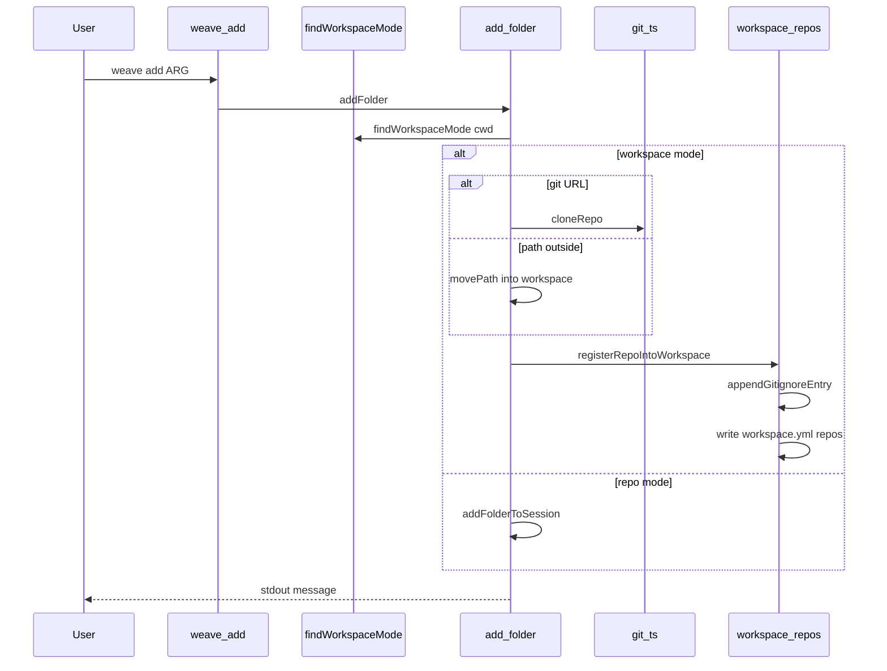
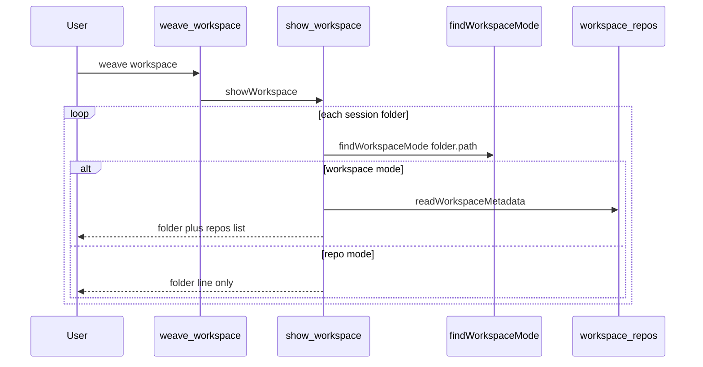

# Add Repo Or Folder To A Weave Workspace Architecture

## Summary

Make `weave add` and `weave workspace` mode-aware using a shared helper that walks up from the working directory to find `.weave/workspace.yml` and reads `mode`. In workspace mode, `weave add` becomes the canonical command for growing a workspace: clone by URL, register an in-workspace path, or adopt an outside path by moving it into the workspace root, then append `.gitignore` and write `workspace.yml.repos` with an optional `remote`. In repo mode, `weave add` stays session-only. `weave workspace` gains an additive `repos` listing for workspace-mode folders by reading committed `workspace.yml`, so teammates and fresh clones see the same registry the author committed.

Affected modules: new `workspace-mode.ts` and `workspace-repos.ts`; changes to `add-folder.ts`, `init-workspace.ts`, `show-workspace.ts`, `git.ts`; tests in `init.test.ts`; docs in README and core command reference knowledge.

No schema version bump. No new CLI commands.

## PRD Context

- **PRD**: [wiki/changes/260604-2u05-add-a-repo-folder/prd.md](wiki/changes/260604-2u05-add-a-repo-folder/prd.md)
- **Product goals supported**: persisted workspace registry, automatic gitignore, git remote capture, URL clone, observable `weave workspace`, unchanged repo mode.
- **Non-goals affecting design**: no `weave remove`, no `--into` override, no session.folders pre-population, no `--target all` fan-out fix for sub-repos in v1.
- **Product assumptions**: users run `git clone` with their own credentials; remote URLs may appear in plain text in `workspace.yml` (same as `git remote -v`).

## Current System

### Entry points

- `weave add <path>`: [src/commands/add.ts](src/commands/add.ts) calls [src/lib/add-folder.ts](src/lib/add-folder.ts).
- `weave workspace`: [src/commands/workspace.ts](src/commands/workspace.ts) calls [src/lib/show-workspace.ts](src/lib/show-workspace.ts).
- `weave init --mode workspace`: [src/lib/init-workspace.ts](src/lib/init-workspace.ts) `scaffoldWorkspace` writes initial `workspace.yml` and `.gitignore`, optionally adopting a git repo via `movePath`.

### Registries

- **`~/.cache/weave/current-session.yml`**: `session.folders` holds per-folder runtime state (`current_change`, `current_artifact`). Workspace init puts only the workspace folder in session; sub-repos are not pre-registered.
- **`.weave/workspace.yml`**: committed `repos` map `{ path, kind, remote? }`. Populated at init for adopted repos only today.

### Git helpers

- [src/lib/git.ts](src/lib/git.ts): `findGitRoot`, `getGitRemote`, `runGitRequired`. No `git clone` wrapper yet.

### YAML convention

- Parse with `YAML.parse`, mutate object, write with `YAML.stringify` (same as [src/lib/changes.ts](src/lib/changes.ts) for `status.yml`). Comments in hand-edited YAML are not preserved on rewrite.

### Tests

- [tests/init.test.ts](tests/init.test.ts): temp-dir integration tests for init modes, repo-mode `weave add`, and basic `showWorkspace` JSON output.

## Proposed Architecture

### New module: `src/lib/workspace-mode.ts`

```typescript
export type WorkspaceMode = "workspace" | "repo";

export type FindWorkspaceModeResult = {
  mode: WorkspaceMode;
  workspacePath: string;
  workspaceYmlPath: string;
} | undefined;

export async function findWorkspaceMode(startPath: string): Promise<FindWorkspaceModeResult | undefined>;
```

**Algorithm**: Starting at `realpath(startPath)`, walk up parent directories. At each level, if `.weave/workspace.yml` exists, parse it. If `mode === "workspace"`, return workspace mode with that directory as `workspacePath`. If `mode === "repo"`, return repo mode with that directory as `workspacePath`. If file missing at all ancestors, return `undefined` (caller treats as repo mode for `weave add` from cwd context).

For `weave add`, call `findWorkspaceMode(cwd)`. If result is workspace mode, use workspace branch; else repo branch.

For `weave workspace`, call `findWorkspaceMode(folder.path)` per session folder entry.

### New module: `src/lib/workspace-repos.ts`

Exports:

- `isGitUrl(input: string): boolean` — `^(git@|https?:\/\/|ssh:\/\/|git:\/\/)`
- `repoNameFromUrl(url: string): string` — basename without `.git`
- `isInsideWorkspace(workspacePath: string, candidatePath: string): Promise<boolean>` — `realpath` both, `path.relative`, reject `..` prefix or absolute relative
- `relativeRepoPath(workspacePath: string, repoAbsolutePath: string): string` — posix-style relative path for `workspace.yml.repos.*.path`
- `readWorkspaceMetadata(workspacePath: string): Promise<WorkspaceMetadata | undefined>` — parse workspace.yml, return undefined on missing/malformed
- `findRegisteredRepoByPath(metadata, relativePath): string | undefined` — returns existing repo id if path matches
- `appendGitignoreEntry(workspacePath: string, relativePath: string): Promise<void>` — idempotent append of `/<relativePath>/` (precise path, trailing slash)
- `registerRepoInWorkspaceMetadata(workspacePath, { id, relativePath, kind, remote? }): Promise<void>` — read, merge repos entry, write; error on slug collision with different path
- `registerRepoIntoWorkspace(input): Promise<RegisterRepoResult>` — orchestrates gitignore + metadata write after folder is on disk

`registerRepoIntoWorkspace` does **not** clone or move; callers (`add-folder`, init) prepare the folder first.

Init refactor: `scaffoldWorkspace` still creates empty workspace.yml via `writeFileIfMissing` and initial gitignore template. For pre-seeded `repos` at init time (adopted repo), call `registerRepoIntoWorkspace` or inline the same helpers so adopt-at-init and add-post-init produce identical `repos` + gitignore shape.

### `src/lib/add-folder.ts` workspace branch

Prerequisites: active session exists (same as today — user must have run `weave init`).

Flow:

1. `findWorkspaceMode(cwd)` → if not workspace mode, fall through to existing repo-mode path.
2. If `isGitUrl(targetPath)`:
   - `destName = repoNameFromUrl(targetPath)`
   - `destPath = join(workspacePath, destName)`
   - Refuse if `destPath` exists
   - `cloneRepo(url, destPath, workspacePath)` via new git helper
   - `remote = targetPath` (URL used for clone)
3. Else resolve absolute path:
   - If inside workspace: `repoPath = resolved`, `relativePath = relativeRepoPath(...)`
   - If outside: `destPath = join(workspacePath, basename(source))`, refuse if exists, `movePath(source, destPath)`, then relative path = basename
4. `findRegisteredRepoByPath` → if found, return `already_exists` (workspace-specific message)
5. `getGitRemote(repoPath)` unless remote already set from URL step
6. `registerRepoIntoWorkspace({ workspacePath, id: folderId ?? slugify(basename), kind: folderKind ?? "app", relativePath, remote })`
7. Do **not** call `addFolderToSession` for the sub-repo
8. Return success message pointing at `weave workspace`

Extend `AddFolderStatus` with `workspace_registered` or reuse `added` with different message. Keep `already_exists` for duplicate path.

### `src/lib/show-workspace.ts`

For each `session.folders` entry:

1. `modeResult = await findWorkspaceMode(folder.path)`
2. If `modeResult?.mode === "workspace"`:
   - `metadata = await readWorkspaceMetadata(modeResult.workspacePath)`
   - If metadata?.repos: map to `repos: [{ id, path, kind, remote? }]`
   - Else: omit repos (graceful)
3. Text output: after folder line, if repos length > 0:

```text
    Repos:
      billing  billing  app  git@github.com:foo/billing.git
```

4. JSON: additive `repos` array on folder object

Repo-mode folders: unchanged output.

Update footer hint: keep `weave add <path>` for workspace context.

### `src/lib/git.ts`

Add:

```typescript
export async function cloneRepo(url: string, destinationPath: string, cwd: string): Promise<void>
```

Uses `runGitRequired(["clone", url, destinationPath], cwd)` where `cwd` is workspace root (clone creates `destinationPath` as final arg name).

### `src/commands/add.ts`

Description update: mention workspace mode accepts path or git URL. No new flags.

## Data Flow





## Architecture Decisions

| Decision | Rationale | Consequences |
|----------|-----------|--------------|
| Mode detection in dedicated module, walk-up on `workspace.yml` | Survives session reset; teammates see same mode from committed file | Must parse YAML at each command; negligible cost |
| Workspace add does not touch `session.folders` | Matches init; `workspace.yml` is committed truth | `--target all` does not list sub-repos; accepted v1 limit |
| Single `registerRepoIntoWorkspace` write path | Init and add produce identical artifacts | Init refactor required; tests must cover both paths |
| Path-based idempotency | Prevents duplicate clone/move on re-run | Different `--id` for same path still no-ops |
| Precise gitignore paths (`/services/audit/`) | Matches PRD default; avoids over-broad ignores | Nested paths need correct relative path computation |
| Basename slug with collision error | Matches init slugify convention | User must pass `--id` when two nested folders share basename |
| Five URL schemes only | PRD scope; covers common remotes | Odd schemes need manual clone + path add |
| `YAML.parse` + `stringify` | Consistent with codebase | User comments in workspace.yml lost on add |

## Rejected Alternatives

- **Dual-write to session.folders and workspace.yml on add**: Rejected; only helps local user until show-workspace reads workspace.yml anyway.
- **`weave workspace add` subcommand**: Rejected; one verb with mode dispatch.
- **yaml Document API**: Rejected for consistency with status.yml updates.
- **Eager session.folders hydration from workspace.yml**: Rejected as larger refactor; deferred.

## Constraints and Tradeoffs

- `fs.rename` adoption fails cross-device (EXDEV); same as init today.
- No transactional multi-step rollback; recovery via re-run `weave add ./dirname`.
- Malformed `workspace.yml` on read: show-workspace degrades silently; add may throw parse error (acceptable — user must fix file).

## Integration Points

- **git CLI**: clone, config get remote (existing), init (existing).
- **yaml@2**: parse/stringify workspace.yml.
- **node:fs/promises**: rename, readFile, writeFile, access.

## Rollout and Migration

- Fully additive. Existing workspaces gain visible adopted repo in `weave workspace` immediately after deploy.
- No migration script. Users with hand-edited registries continue to work; new adds merge into existing `repos` map.

## Observability and Operations

- Success/failure via stdout/stderr only.
- Clone failures bubble `git clone` error text with short Weave prefix.
- No metrics or structured logs.

## Testing Strategy

Extend [tests/init.test.ts](tests/init.test.ts):

| Case | Assert |
|------|--------|
| Workspace add inside path | `workspace.yml.repos`, gitignore line |
| Workspace add outside path | folder moved, registered |
| Workspace add URL | local bare repo as remote; clone + remote field |
| Non-git folder | no `remote` key |
| Duplicate add | no file mutation, already_exists |
| Clone dest exists | throws, no yml/gitignore change |
| Repo mode add | unchanged session behavior |
| Repo mode workspace | unchanged JSON |
| Workspace mode workspace JSON | `repos` array present |
| Malformed workspace.yml | no crash, no repos in output |
| Init adopt repo | `weave workspace` shows adopted repo in Repos block |

Use `mkdtemp` + real `git` subprocesses per existing tests.

## Security and Data Integrity

- Clone runs as invoking user; no credential storage.
- Tokens in URLs would be stored in `workspace.yml` if user passes them; document in Assumptions.
- Move adoption preserves dirty tree (no clean guard).
- Path traversal prevented via `realpath` + relative check before register.

## Implementation Risks

| Risk | Impact | Mitigation |
|------|--------|------------|
| EXDEV on cross-fs move | Add fails mid-flow | Clear error message; manual cp + add |
| Slug collision | Register fails | Error with `--id` hint |
| Partial failure after clone | Orphan directory | Re-run add path form converges |
| YAML rewrite drops comments | User confusion | Document; match status.yml behavior |

## Assumptions

- `workspace.yml` `version: 1` schema unchanged.
- Session must exist before `weave add` in both modes (current behavior).
- Git is on PATH.
- Relative paths in `repos.*.path` use forward slashes on all platforms (posix relative from `path.relative`).

## Open Technical Questions

Resolved for implementation:

1. **Gitignore granularity**: precise path (`/services/audit/`).
2. **Nested slug**: basename; error on collision with different path.
3. **URL schemes**: `git@`, `https://`, `http://`, `ssh://`, `git://` only.

## Product Questions Raised by Technical Design

None.

## Revision History

- 2026-06-04: Initial architecture generated from `prd.md`, exploration decisions, approved implementation plan, and codebase review (`init-workspace.ts`, `add-folder.ts`, `show-workspace.ts`, `git.ts`).
