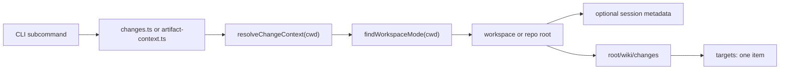

# Make Change And Artifact Commands Workspace Aware Architecture

## Summary

This change makes `weave change` and `weave artifact` use the same cwd-dispatched context model already used by `weave add` and `weave workspace`. Commands will walk up from `cwd` to the nearest valid `.weave/workspace.yml`, then operate on exactly one change root: the workspace root in workspace mode or the repo root in repo mode.

The main implementation strategy is to introduce a shared context resolver on top of `findWorkspaceMode(cwd)`, then rewire the change and artifact command libraries to use that resolver instead of resolving targets from `session.folders` and `realpath(cwd)`. The CLI-level multi-target surface is removed: no `--target`, no `all` positional target, no `weave change propagate`.

The public JSON result envelope keeps the existing `targets: [...]` array shape, but every affected command now returns exactly one target. This avoids churn for skills and external consumers while removing multi-target behavior from the user-facing command surface.

## PRD Context

PRD: `wiki/changes/260605-2sy1-make-change-and-artifact-commands-workspace/prd.md`

This architecture supports these product goals:

- Resolve all `weave change` and `weave artifact` commands by walking up from `cwd`.
- Treat workspace mode as a single workspace-level change and artifact store.
- Treat repo mode nested directories as part of the containing repo-mode Weave root.
- Remove obsolete `--target`, `all`, and `weave change propagate` behavior.
- Preserve the existing lifecycle and artifact storage model under `wiki/changes/<change-id>/`.

Product non-goals that shape the design:

- No per-sub-repo `wiki/changes/` support.
- No `status.yml.scope`, touched-repo metadata, or target schema.
- No compatibility shim for `--target`.
- No migration or cleanup of accidental sub-repo-local Weave scaffolds.

## Current System

`weave add` and `weave workspace` already use `findWorkspaceMode(cwd)` from `src/lib/workspace-mode.ts`. That helper realpaths the starting directory, walks upward looking for `.weave/workspace.yml`, parses the mode, and returns the containing workspace or repo root.

The change and artifact command family still uses older target resolution in `src/lib/changes.ts`. Functions such as `resolveTargets`, `resolveQueryTargets`, and `resolveTarget` resolve explicit names and paths against `session.folders` and fall back to `realpath(cwd)`. They do not call `findWorkspaceMode`, so running from inside a workspace sub-repo resolves to the sub-repo path instead of the workspace root.

The current CLI surface in `src/commands/change.ts` exposes multi-target concepts:

- `weave change new --target <target...>`
- `weave change list [target]`
- `weave change current [target]`
- `weave change status --target <target>`
- `weave change progress --target <target>`
- `weave change clear-stale --target <target>`
- `weave change knowledge --target <target>`
- `weave change propagate <change-id> --to <target...>`

`src/commands/artifact.ts` similarly exposes `weave artifact current [target]` and `--target` options for setting or clearing artifact context.

Session state remains important, but its current role is too broad. `session.folders` stores folder identity and the active change/artifact context for a folder. It should not be the source of truth for deciding whether the current directory belongs to a workspace or repo mode root.

## Proposed Architecture

Add a shared resolver that composes mode discovery with optional session metadata:

1. Call `findWorkspaceMode(cwd)`.
2. If no mode is found, throw `ChangeCommandError("no_weave_context", "No Weave context found. Run `weave init` first.")`.
3. Use the resolved `workspacePath` as the single command root.
4. Load the local session and call `findFolderByPath` for that root, when possible.
5. Return a context object containing the root path, mode, and optional session folder id/name.

The resolver should be placed near the existing mode helpers, most likely in `src/lib/workspace-mode.ts`, because it is a small layer on top of mode detection and session lookup. `src/lib/changes.ts` will adapt that context into the existing `ChangeTarget` shape internally.

All public functions in `src/lib/changes.ts` should resolve exactly one context from `cwd`:

- `createChange`
- `listChanges`
- `currentChange`
- `statusChange`
- `progressChange`
- `clearChangeStaleness`
- `knowledgeChange`
- `switchChange`

All `target` and `targets` fields should be removed from the public option types. Return shapes should remain stable where practical, especially the one-element `targets` array used by skills and tests.

`src/lib/artifact-context.ts` should drop `target` options and inherit the same cwd dispatch by delegating through `currentChange` and the session state helpers for the resolved root.

The CLI command definitions should remove the obsolete surface:

- Remove every `--target` option from `src/commands/change.ts`.
- Remove `[target]` positionals from `weave change list` and `weave change current`.
- Remove the `propagate` subcommand from `src/commands/change.ts`.
- Remove `[target]` and `--target` from `src/commands/artifact.ts`.

The `weave-propagate` skill should be deleted from templates and installed skill locations. `weave-new` and `weave-next` guidance should stop mentioning `--target`, `all`, or propagation flows.

## Data Flow

The new flow is:

1. User or agent runs a change/artifact command from any directory.
2. Command passes `process.cwd()` to the library.
3. Library calls the shared context resolver.
4. Resolver walks up to `.weave/workspace.yml`.
5. Library reads or writes `wiki/changes/` under the resolved root.
6. CLI prints text or JSON with one target.

Workspace example:

- `cwd`: `peoplebox-platform/billing/`
- mode file: `peoplebox-platform/.weave/workspace.yml` with `mode: workspace`
- command root: `peoplebox-platform/`
- change store: `peoplebox-platform/wiki/changes/`

Repo-mode example:

- `cwd`: `single-app/src/routes/`
- mode file: `single-app/.weave/workspace.yml` with `mode: repo`
- command root: `single-app/`
- change store: `single-app/wiki/changes/`

## Architecture Decisions

### Use `findWorkspaceMode(cwd)` for all change and artifact context resolution

Rationale: this is already the canonical mode detector for workspace-aware commands. Reusing it keeps behavior consistent across `weave add`, `weave workspace`, `weave change`, and `weave artifact`.

Consequences: change and artifact commands become deterministic from nested directories. The resolver no longer treats the exact `cwd` as the change root when a containing Weave root exists.

### Keep `targets: [...]` as a one-element JSON array

Rationale: skills, tests, and external JSON consumers already read `targets[0]`. The product goal is to remove multi-target behavior, not to force a JSON migration.

Consequences: the shape remains slightly redundant, but the implementation guarantees there is exactly one target for affected commands.

### Throw `ChangeCommandError("no_weave_context", ...)` outside any Weave context

Rationale: existing command error handling already serializes `ChangeCommandError` to `{ status: "error", code, message }` for JSON callers.

Consequences: callers receive a familiar error envelope. The CLI exits non-zero and gives the user a direct initialization hint.

### Delete propagation instead of deprecating it

Rationale: `weave change propagate` exists to copy artifacts between folders, which conflicts with the workspace-only change store model.

Consequences: users who invoke the command get an unknown subcommand error. Documentation and skills must be updated in the same change.

## Rejected Alternatives

### Keep `--target` as a compatibility alias

Rejected because it keeps a dead mental model in the command surface. Users would still wonder whether targets select sub-repos or artifact stores.

It might become viable only if Weave later reintroduces explicit multi-context operations with a different product model.

### Collapse JSON to `target: {...}`

Rejected because it creates unnecessary churn for skills and consumers. The new behavior can be expressed without changing the envelope.

It might become viable in a later major cleanup if JSON consumers are inventoried and migrated together.

### Auto-register workspace sub-repos in `session.folders`

Rejected because it mutates session state as a side effect of read or lifecycle commands and undermines the workspace-only artifact model.

It might become viable only for a separate workspace membership feature, not for change/artifact context resolution.

### Keep `weave change propagate` for repo mode only

Rejected because the command remains confusing and no longer has a clear role once changes are cwd-dispatched and single-context.

## Constraints and Tradeoffs

- This is a pre-1.0 local CLI, so breaking removal of obsolete options is acceptable.
- The design relies on `.weave/workspace.yml` being present and parseable. Malformed files should fail conservatively rather than scaffold nested state.
- `session.folders` remains the storage location for active change and artifact context; it is no longer the primary context resolver.
- Keeping the plural JSON envelope trades conceptual neatness for compatibility.
- No migration is included for accidental sub-repo-local `wiki/changes/` directories.

## Integration Points

Internal integration points:

- `src/lib/workspace-mode.ts`: add the shared change context resolver.
- `src/lib/changes.ts`: replace multi-target resolution and delete propagation logic.
- `src/lib/artifact-context.ts`: remove target options and rely on the resolved single context.
- `src/lib/session-state.ts`: continue to store and retrieve current change/artifact context by resolved root path.
- `src/commands/change.ts` and `src/commands/artifact.ts`: remove obsolete CLI options and subcommands.

Documentation and agent integration points:

- `README.md`
- `wiki/knowledge/domains/cli-commands/features/core-command-reference/behavior.md`
- change workflow knowledge docs
- `weave-new` and `weave-next` skills
- removal of all `weave-propagate` skill copies and templates

No external services, network APIs, databases, schedulers, or third-party integrations are affected.

## Rollout and Migration

Rollout is a single code and documentation change. No feature flag or data migration is required.

Normal workspace and repo users keep their existing `wiki/changes/` directories. The command root changes only when commands are run from nested directories that previously resolved incorrectly.

Rollback is straightforward: revert the code and docs. No durable data format changes are introduced.

User-facing communication should call out:

- Change and artifact commands are now cwd-dispatched.
- In workspace mode, commands run from anywhere inside the workspace operate on the workspace change store.
- `--target`, `all`, and `weave change propagate` are removed.

## Observability and Operations

This is a local CLI change. No metrics, dashboards, alerts, or distributed traces are required.

Operationally relevant failure modes:

- No `.weave/workspace.yml` above `cwd`: command fails with `no_weave_context` and an initialization hint.
- Malformed workspace metadata: command fails conservatively instead of creating nested Weave state.
- Stale skill/docs references: commands fail with unknown option or subcommand. This is mitigated by updating all shipped and installed skill copies in the same change.

## Testing Strategy

Automated verification should use the existing Vitest suite:

- `npm test`
- `npm run typecheck`

Tests should cover:

- Workspace root commands still operate on `workspace/wiki/changes/`.
- Commands run from a nested workspace sub-repo resolve to the workspace root.
- Commands run from a nested repo-mode directory resolve to the repo root.
- Commands outside any Weave context throw `ChangeCommandError` with `code: "no_weave_context"`.
- `weave artifact current`, `current set`, and `current clear` use the same resolved root as `weave change current`.
- Removed `target` options are absent from library option types and command definitions.
- Propagation tests are deleted or replaced with single-context behavior tests.

Manual smoke verification:

- Initialize a workspace with a registered sub-repo, create a change at the workspace root, then run `weave change current --json` and `weave artifact current --json` from inside the sub-repo.
- Run `weave change new --target app` and confirm Commander rejects the unknown option.
- Run `weave change propagate` and confirm the subcommand no longer exists.

## Security and Data Integrity

There is no new privilege boundary and no sensitive data handling change. The resolver reads local workspace metadata and session state only.

The main data integrity invariant is that change and artifact writes must target the resolved Weave root, never an arbitrary nested directory. In workspace mode this prevents accidental `wiki/changes/` creation inside registered sub-repos.

Session state remains scoped by resolved root path. If a session folder entry is missing, commands can still operate on the filesystem root found by `findWorkspaceMode`; only display metadata such as id/name may be absent.

## Implementation Risks

- Risk: A command path still passes a removed `target` option internally.
  Impact: Typecheck or tests fail, or a stale path preserves old behavior.
  Mitigation: remove target fields from option types and run `npm run typecheck`.

- Risk: Stale skill guidance still invokes `--target` or `change current all`.
  Impact: agents fail when following obsolete instructions.
  Mitigation: search all templates and installed skill directories for `--target`, `change current all`, and `propagate`.

- Risk: Symlinked paths cause session metadata not to match the resolved root.
  Impact: cosmetic missing id/name or source metadata.
  Mitigation: use the realpath returned by `findWorkspaceMode` when calling `findFolderByPath`.

- Risk: Tests accidentally keep relying on implicit no-mode fallback.
  Impact: suite failures after introducing `no_weave_context`.
  Mitigation: update test fixtures to initialize repo or workspace mode explicitly when exercising change/artifact commands.

## Assumptions

- The existing `targets: [...]` JSON envelope should remain stable for this change.
- Pre-1.0 compatibility expectations allow direct removal of obsolete CLI options.
- No important user data exists only in accidental sub-repo-local change stores.
- `findWorkspaceMode` is the right source of truth for workspace/repo mode.

## Open Technical Questions

None blocking.

## Product Questions Raised by Technical Design

None.

## Revision History

- 2026-06-05: Initial architecture generated from `prd.md`, architecture discussion, and codebase review.
