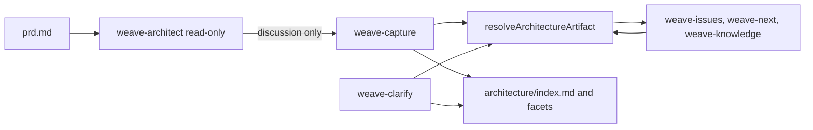

# Folder-Based Architecture Artifact And Template Kit Architecture

## Summary

This change introduces folder-mode architecture artifacts for future Weave changes while preserving legacy `architecture.md` behavior. The implementation has two halves:

- runtime/repo behavior: add a shared architecture artifact resolver so CLI lifecycle heuristics and reader skills can understand `architecture.md`, `architecture/index.md`, and facet files consistently
- skill/template behavior: make `weave-architect` read-only, move architecture document structures into direct child template resources, and teach `weave-capture`, `weave-clarify`, `weave-issues`, `weave-next`, and `weave-knowledge` how to consume or write the new shape

The architecture lane remains one lifecycle lane in `status.yml`. Folder mode changes the storage layout, not the lifecycle model. `architecture/index.md` is the preferred entry point, but folder-mode architecture is substantive if either the index or any facet file is substantive. This allows users to capture a deep facet first without blocking downstream work.

No new CLI flags are required. Skill invocation remains natural-language driven.

## PRD Context

- **PRD**: `wiki/changes/260606-k0l6-architecture-folder/prd.md`
- **Primary product goals**: read-only `weave-architect`; folder-based architecture; user-owned templates without `SKILL.md` edits; capture/clarify as writers; downstream reader compatibility; `weave-issues` coverage/sync gate.
- **Key non-goals**: workspace-mode multi-repo context gathering; per-facet lifecycle state; automatic migration of legacy `architecture.md`; new CLI flags.
- **Important clarification**: architect template files are direct child skill resources beside `SKILL.md`, not nested under `weave-architect/templates/`.

## Current System

### Skill resource installer

`src/lib/agent-skills.ts` already supports managed skill resources as direct child `.md` files beside `SKILL.md`.

Important current behavior:

- `listDefaultSkillResources` reads direct child files only.
- `validateSkillResourceName` accepts names like `api-contract-template.md`.
- manifest entries use names like `weave-prd/prd-template.md`.
- install/update/reset/diff preserve user-modified resources.

This means the architecture template kit can be implemented without changing resource traversal if templates are direct child files:

```text
templates/skills/weave-architect/
  SKILL.md
  index-template.md
  schema-template.md
  api-contract-template.md
  frontend-backend-template.md
```

### CLI lifecycle checks

`src/lib/changes.ts` currently hardcodes `architecture.md` in at least two lifecycle-adjacent places:

- `resolveProgressSources` infers `architecture` as an issues source only if `artifactFileName("architecture")` is substantive, which currently resolves to `architecture.md`.
- `hasIssueEvidence` scans `exploration.md`, `prd.md`, and `architecture.md` for issue URLs or issue numbers.

Folder-mode architecture would be invisible to those checks unless CLI code gets a shared resolver.

### Skill templates

Several skill templates hardcode `architecture.md`:

- `weave-architect`: writes `architecture.md` and embeds the full architecture template.
- `weave-capture`: maps architecture capture to `wiki/changes/<change-id>/architecture.md`.
- `weave-clarify`: reads/writes `architecture.md`.
- `weave-issues`: reads `architecture.md` as engineering design.
- `weave-next`: uses `architecture.md` to decide whether to recommend architect or issues.
- `weave-knowledge`: reads `architecture.md` as supporting change context.

These are instruction changes, not TypeScript runtime code, but they must be updated together to avoid partial behavior.

### Existing tests

`tests/agent-skills.test.ts` already covers:

- direct child resources such as `prd-template.md` and `knowledge-templates.md`
- install/update/reset/diff for user-modified resources
- installed repo skill copies staying aligned with bundled templates
- opencode wrapper installation
- common skill boilerplate blocks

These tests are the main place to extend coverage for direct child architect templates.

## Proposed Architecture

### Shared architecture artifact resolver

Add a new helper module, suggested path:

```text
src/lib/architecture-artifact.ts
```

Suggested API:

```ts
export type ArchitectureArtifactState =
  | {
      status: "missing";
      filePath: string;
      folderPath: string;
    }
  | {
      status: "conflict";
      filePath: string;
      folderPath: string;
    }
  | {
      status: "file";
      path: string;
      substantive: boolean;
    }
  | {
      status: "folder";
      folderPath: string;
      indexPath: string;
      indexExists: boolean;
      indexSubstantive: boolean;
      facetPaths: string[];
      substantiveFacetPaths: string[];
      substantive: boolean;
      partial: boolean;
    };

export async function resolveArchitectureArtifact(changePath: string): Promise<ArchitectureArtifactState>;
```

Resolution rules:

- `architecture.md` exists and `architecture/` does not: `file`.
- `architecture/` exists and `architecture.md` does not: `folder`.
- both exist: `conflict`.
- neither exists: `missing`.
- folder mode scans direct child markdown files under `architecture/`.
- `index.md` is special and is not treated as a facet.
- `substantive = indexSubstantive || substantiveFacetPaths.length > 0`.
- `partial = !indexSubstantive && substantiveFacetPaths.length > 0`.

The resolver should share or extract the existing markdown-substance heuristic from `src/lib/changes.ts` so folder mode and file mode use the same definition of "substantive." The current heuristic removes frontmatter, headings, blank lines, and `Not ready`, then checks for remaining content.

### CLI integration

Update `src/lib/changes.ts`:

- In `resolveProgressSources`, replace the hardcoded `architecture.md` check with `resolveArchitectureArtifact(changePath)`.
- For `issues` progress source inference, return `["architecture"]` when the resolver says architecture is substantive in file mode or folder mode.
- In `hasIssueEvidence`, scan:
  - `architecture.md` in file mode
  - `architecture/index.md` and facet files in folder mode
  - neither in missing mode
  - probably both in conflict mode only if needed for evidence, but prefer treating conflict as an error where user-facing commands already support errors

Do not add per-facet source IDs. `architecture` remains the source ID.

### Direct child architect templates

Add bundled skill resources:

```text
templates/skills/weave-architect/index-template.md
templates/skills/weave-architect/schema-template.md
templates/skills/weave-architect/api-contract-template.md
templates/skills/weave-architect/frontend-backend-template.md
```

Each template should include frontmatter:

```yaml
---
facet: schema
description: Data model, persistence, migration, and integrity design.
---
```

Because these are direct child `.md` files, existing resource installer logic can install, update, diff, and reset them without recursive resource support.

### `weave-architect` rewrite

Rewrite `templates/skills/weave-architect/SKILL.md` so the skill is a read-only architecture thinking partner.

Remove or replace:

- instructions to create or revise `architecture.md`
- `Output Path`
- `Lifecycle Progress`
- embedded `Architecture Template`
- lifecycle staleness verification block, because the skill no longer progresses the lane

Keep:

- Plan Mode requirement
- local artifact context setting (`weave artifact current set architecture --json`) if still desired as session state only
- context loading
- codebase inspection
- relentless engineering interview behavior

Add:

- artifact-shape-aware reading: legacy file, folder index, relevant facets, conflict handling
- free-form topic focus behavior
- clear dissection output that can be captured later
- explicit statement: do not read `*-template.md`; templates are for writers

### `weave-capture` architecture updates

Update `templates/skills/weave-capture/SKILL.md` so architecture capture writes folder-mode artifacts for new architecture.

Key behavior:

- resolve architecture artifact shape before writing
- write one lane-level architecture session note per capture
- add `facets: [...]` frontmatter for architecture session notes when known
- use direct child architect templates by `<facet>-template.md` convention
- create `architecture/index.md` for new folder-mode architecture when enough architecture content exists
- create or revise `architecture/<facet>.md` when matching template/content exists
- merge no-template content into existing files where it fits
- create a no-template facet only when the user explicitly asks; use discussion content as-is, no generic skeleton
- update `architecture/index.md` when facets are created, changed, renamed, merged, or deleted
- surface cross-facet contradictions in `index.md` Open Questions without blocking writes
- run one `weave change progress architecture ...` call per successful capture

### `weave-clarify` architecture updates

Update `templates/skills/weave-clarify/SKILL.md` for folder-mode architecture.

Key behavior:

- resolve architecture artifact shape before writing
- support explicit migration from legacy `architecture.md` to folder mode
- support structural primitives:
  - create facet
  - split content
  - merge facets
  - rename facet
  - delete facet
  - move content
  - update index
- preserve lifecycle frontmatter
- report likely follow-up artifacts rather than cascading edits

### Reader skill updates

Update these templates so they no longer hardcode only `architecture.md`:

- `templates/skills/weave-issues/SKILL.md`
- `templates/skills/weave-next/SKILL.md`
- `templates/skills/weave-knowledge/SKILL.md`
- any supporting references in `weave-capture` and `weave-clarify`

Reader behavior:

- legacy file mode: read `architecture.md`
- folder mode: prefer substantive `architecture/index.md`, then load relevant facets
- partial folder mode: if only facets are substantive, use them but report architecture as partial
- conflict mode: report conflict and do not silently choose one shape

### `weave-issues` coverage and consistency gate

Update `weave-issues` so source artifacts are optional, but verification runs opportunistically:

- If `prd.md` exists and is usable, verify task coverage for PRD workflows, user stories, functional requirements, acceptance criteria, and edge cases.
- If architecture exists and is usable, verify task coverage for architecture decisions, affected systems, migrations, rollout notes, risks, observability, and testing strategy.
- If both PRD and architecture exist, verify they do not obviously contradict each other.
- If either artifact is missing, do not block task generation solely because it is missing.
- If gaps or mismatches are found, ask the user whether to add tasks, defer scope, return to clarification/architecture, or proceed with known gaps before writing `tasks.md`.

This makes `weave-issues` the downstream quality gate without making earlier lanes rigid prerequisites.

## Data Flow



## Architecture Decisions

| Decision | Rationale | Consequences |
| --- | --- | --- |
| Use a shared architecture artifact resolver | CLI code already has hardcoded architecture file checks; skill text alone would be insufficient | Adds a small reusable module and focused tests |
| Treat folder architecture as substantive if index or any facet is substantive | Supports incremental facet-first design | Reader skills must report partial architecture when index is thin |
| Keep templates as direct child resources | Existing installer already supports direct child `.md` resources | No nested resource support needed; PRD wording must consistently reflect this |
| Keep lifecycle lane-atomic | Avoids per-facet stale complexity | One architecture progress event covers all facets |
| Make `weave-architect` read-only | Restores clean separation: architect thinks, capture writes | Architecture writes move to capture/clarify |
| Make `weave-issues` the consistency gate | Task generation is where under-scoping becomes dangerous | Issues skill becomes more analytical before writing |

## Rejected Alternatives

- **Nested `weave-architect/templates/*.md` resources**: rejected because direct child resources fit current installer behavior and are simpler.
- **Index-gated architecture substance**: rejected as too restrictive for users who deep-dive facets first.
- **Skill-only artifact shape rules**: rejected because CLI source inference also needs to understand folder mode.
- **New CLI flags for facet targeting**: rejected by product decision; skills parse natural-language intent.
- **Per-facet lifecycle state**: rejected for v1; lane-level progress is sufficient.

## Constraints and Tradeoffs

- Existing skills are markdown instructions, not code. The resolver can be used by CLI internals, while skill templates must describe the same behavior for agents.
- Direct child template resources mean user-added templates sit beside `SKILL.md`. This is less visually grouped than a nested folder but matches the current installer and manifest design.
- Partial architecture increases flexibility but requires reader skills to be honest about incompleteness.
- The current `weave-issues` skill requires user approval before writing tasks; adding coverage review fits that existing interaction model.

## Integration Points

- `src/lib/agent-skills.ts`: direct child resource discovery, install/update/reset/diff behavior.
- `src/lib/changes.ts`: architecture source inference for issues progress and issue evidence scanning.
- `templates/skills/weave-architect/SKILL.md`: read-only architecture interview behavior.
- `templates/skills/weave-capture/SKILL.md`: folder-mode architecture writing.
- `templates/skills/weave-clarify/SKILL.md`: folder-mode architecture restructuring.
- `templates/skills/weave-issues/SKILL.md`: optional-source coverage and consistency gate.
- `templates/skills/weave-next/SKILL.md`: folder-mode state/recommendation logic.
- `templates/skills/weave-knowledge/SKILL.md`: architecture context reading.
- `tests/agent-skills.test.ts`: template/resource install expectations and skill text assertions.

## Rollout and Migration

- New architecture captures should create folder mode.
- Existing `architecture.md` changes continue to work.
- Migration from `architecture.md` to `architecture/` happens only when the user explicitly asks `weave-clarify architecture`.
- Installed user templates are protected by existing resource modification rules.
- The release should update bundled templates and users can run their normal `weave agent update`/reset flow as appropriate.

## Observability and Operations

There is no telemetry. Operational visibility is via:

- skill completion messages
- `weave change status --json`
- `.weave/agents.yml` resource manifest entries
- tests asserting install/update/reset behavior

Shape conflict messages should name both `architecture.md` and `architecture/` so users know what to resolve.

## Testing Strategy

Add or update tests for:

- `resolveArchitectureArtifact`:
  - missing
  - legacy file substantive/non-substantive
  - folder with substantive index
  - folder with thin index and substantive facet
  - folder with no substantive files
  - conflict
- `src/lib/changes.ts`:
  - `change progress issues` infers `architecture` from folder-mode substantive index
  - infers from substantive facet-only folder
  - does not infer when folder mode is non-substantive
  - issue evidence scanning includes folder-mode architecture files
- `tests/agent-skills.test.ts`:
  - direct child architect templates are installed for all agents
  - user-modified architect templates are preserved
  - introduced/updated architect templates install/update like PRD resources
  - reset restores architect template resources
  - opencode install includes architect template resources
  - bundled skill text no longer asserts `weave-architect` is a progress caller if it no longer calls progress
- skill template assertions:
  - `weave-architect` is read-only and has no `Output Path` or embedded template
  - `weave-capture` describes folder-mode writes
  - `weave-clarify` describes structural primitives
  - `weave-issues` describes optional-source coverage/sync review
  - reader skills describe architecture shape resolution

Verification commands:

```bash
npm run typecheck
npm run test
```

## Security and Data Integrity

- No sensitive data handling changes.
- Shape conflict detection prevents agents from silently reading one architecture shape while ignoring another.
- User-modified templates are preserved by manifest hash checks.
- No destructive migration occurs automatically.

## Implementation Risks

| Risk | Impact | Mitigation |
| --- | --- | --- |
| Skill templates and CLI resolver drift | Agents and CLI disagree on architecture shape | Keep resolver behavior summarized in every relevant skill; add tests for hardcoded `architecture.md` references |
| `weave-issues` coverage review becomes too heavy | Task generation feels slow or overly interrogative | Keep review focused on meaningful workflows/decisions; ask only when gaps affect implementation scope |
| Partial architecture causes under-scoped tasks | Missing implementation work | `weave-issues` reports partial architecture and runs coverage checks against available sources |
| Existing boilerplate tests fail after architect stops progressing | Test suite red | Update progress-caller expectations to remove `weave-architect` |

## Assumptions

- Direct child skill resources are sufficient for user-customizable architecture templates.
- `weave-capture` can create folder-mode architecture even before the new behavior exists, once the skill template is updated.
- Reader skills can be updated by instruction without needing all of them to call TypeScript APIs directly.
- The artifact resolver's markdown-substance heuristic can reuse the existing `hasSubstantiveMarkdown` behavior.

## Open Technical Questions

None blocking. One cleanup note: the current PRD still contains a workflow line that says users add custom templates under `weave-architect/templates/`; implementation should follow the later direct-child decision and that PRD wording should be cleaned up when convenient.

## Product Questions Raised by Technical Design

None.

## Revision History

- 2026-06-06: Initial architecture generated from `prd.md`, architecture discussion, and codebase review (`agent-skills.ts`, `changes.ts`, skill templates, and `agent-skills.test.ts`).
