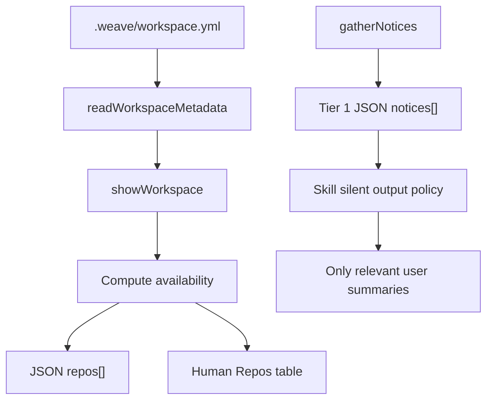

# Fixes Around Existing Commands Architecture

## Decision Summary

- Add workspace repo availability as runtime display state, not persisted workspace metadata.
- Expose `availability: "present" | "missing"` on workspace-mode `repos[]` in `weave workspace --json`.
- Add availability as a dedicated column in human-readable `weave workspace` output.
- Keep repo-mode `folders[]` unchanged for this change.
- Leave missing-repo task blockers in `src/lib/task-prepare.ts` unchanged.
- Replace the old shared `# Surface Weave Notices` skill boilerplate with a silent command output policy and concrete user-facing notice copy.
- Update generated skill copies in `templates/skills`, `.agents/skills`, and `.claude/skills` together to avoid drift.
- Clarify the top-level `weave-architect` read-only contract so agents do not mistake local session-state lane commits for forbidden repo-tracked artifact writes.
- Verify the `weave-architect` lane commit, but continue architecture work with a warning if the stored lane could not be updated.

## System Context

The current workspace command path is:

- `src/commands/workspace.ts` defines the CLI command and delegates to `showWorkspace`.
- `src/lib/show-workspace.ts` resolves workspace mode, builds JSON/text output, and currently renders metadata-only repo rows.
- `src/lib/workspace-repos.ts` parses and writes `.weave/workspace.yml` repo metadata.
- `src/lib/add-folder.ts` registers workspace repos and explicitly clones only when the user passes a Git URL to `weave add`.
- `src/lib/task-prepare.ts` already blocks when a selected workspace task references a registered repo path that does not exist.

The current notice/skill path is:

- `src/lib/notices.ts` produces `package_outdated`, `skills_outdated`, and `skills_modified`.
- `src/lib/with-notices.ts` merges notices into Tier 1 JSON output and prints only a short terminal footer for interactive non-JSON output.
- `src/lib/skill-template-checks.ts` currently defines the shared notice boilerplate expected in skill files.
- `tests/agent-skills.test.ts` asserts the old notice boilerplate appears in every bundled skill.
- Skill content exists in `templates/skills`, `.agents/skills`, and `.claude/skills`.
- `templates/skills/weave-architect/SKILL.md` is strongly read-only at the top of the file, and that framing can cause agents in Plan Mode to skip the local session-state lane commit even though the command is inlined later.

## Architecture Overview

Keep the two changes separate:



`workspace-repos.ts` should continue to represent committed repo metadata only. `show-workspace.ts` is the correct place to add local availability because it already owns the user-facing workspace view.

The availability helper should:

1. Iterate over metadata repo entries.
2. Build `absolutePath = path.join(workspacePath, entry.path)`.
3. Use `pathExists(absolutePath)`.
4. Return the existing repo row plus `availability: "present"` or `availability: "missing"`.

Do not use `realpath` for repo availability checks. Missing paths are normal in a fresh workspace clone, and `realpath` would turn that normal condition into an exception-driven flow.

Skill notice behavior should be instruction-level, not a runtime filtering change to `notices[]`. Tier 1 commands can keep returning structured notices for automation. Skills should use the new policy to decide whether and how to mention them.

## Architect Lane Commit Reliability

`weave-architect` has a unique failure mode compared with `weave-explore`. Both skills run in Plan Mode and both inline their lane commit command, but `weave-architect` begins with a very strong read-only contract:

```text
It never creates, edits, renames, deletes, or progresses repo-tracked artifacts.
```

That sentence is technically scoped to repo-tracked artifacts, but it appears before the lane-commit instructions and can cause agents to over-apply the prohibition to `weave artifact current set architecture --json`. The primary fix is to make the distinction explicit at the top of the skill:

```text
This skill never creates, edits, renames, deletes, or progresses repo-tracked artifacts.

It may update local Weave session state only to record that the active artifact lane is `architecture` via `weave artifact current set architecture --json`. This local lane commit is part of entering the architecture lane; it is not a repo-tracked artifact write.
```

The resolve context should still verify the lane after attempting the commit:

```bash
weave artifact current --json
```

If the verified current artifact is not `architecture` for the active change, `weave-architect` should continue the architecture discussion and show a concise warning:

```text
I could not update the stored artifact lane to `architecture`, so `weave-capture` may ask you to confirm the capture target later.
```

Do not make this a hard stop. The architecture discussion remains valuable, and `weave-capture` already has defensive lane verification.

## Notice Message Matrix

### `package_outdated`

Show only when the notice exists. If the package is current, show nothing.

```text
A newer Weave version is available. Run `weave status` for details, then upgrade Weave when convenient.
```

### `skills_outdated`

Suppress for unrelated skills. Show when the invoked skill or an imminent next skill is outdated.

```text
The installed `<skill-name>` skill appears older than the bundled template. Run `weave status` for details, then `weave agent update --all` when you want to refresh installed skills.
```

For multiple relevant skills:

```text
Some installed skills used in this workflow appear older than the bundled templates: `<skill-a>`, `<skill-b>`. Run `weave status` for details, then `weave agent update --all` when you want to refresh them.
```

### `skills_modified`

Suppress unless the invoked skill is modified locally or the user is asking about skill updates.

```text
The installed `<skill-name>` skill has local edits, so its behavior may differ from the bundled template. Run `weave status` or `weave agent diff` if you want to inspect the difference.
```

If the user asks to update skills:

```text
Some installed skills have local edits. `weave agent update` may skip or protect them; run `weave status` or `weave agent diff` before updating.
```

Skills should not say:

- `Notices: ...`
- `The command returned notices`
- raw `notices[].message`
- full notice JSON
- full skill lists unless the user asks for diagnostics

## Facets

- `workspace-command-output`: Covered in this index. Create a separate facet only if availability semantics expand beyond `present` and `missing`.
- `skill-command-output`: Covered in this index. Create a separate facet only if the notice policy or skill-output policy becomes large enough to need independent maintenance.

## Tradeoffs

- Computing availability in `show-workspace.ts` keeps persisted metadata clean but makes the display builder async. This is acceptable because `buildWorkspaceModeResult` is already async.
- Adding an `availability` field is an additive JSON change, which is safer than changing existing field meanings.
- A dedicated human-readable column is more explicit than annotating only missing repos, but it may require minor output formatting changes. Tests should assert meaningful substrings instead of exact spacing.
- Keeping notice filtering in skill guidance preserves structured CLI notices for automation, but relies on agents following instruction text. This matches the current skill-driven architecture.
- Updating installed skill copies in-repo along with templates is more work, but it prevents local tests and actual agent behavior from diverging.
- Clarifying the top-level `weave-architect` contract is more important than adding more repetitions of the lane command. Repetition did not prevent the observed failure; reducing ambiguity at the top of the skill should.
- Non-blocking lane verification allows architecture work to proceed while still explaining why later capture may ask for a target.

## Risks And Mitigations

- Risk: Existing JSON consumers compare repo objects exactly.
  Mitigation: Keep existing fields stable and add only `availability`.
- Risk: Missing repo paths could accidentally throw during availability checks.
  Mitigation: Use `pathExists`, not `realpath`.
- Risk: Notice guidance becomes too quiet.
  Mitigation: The policy still surfaces package outdated notices, relevant outdated skills, relevant modified skills, blockers, failures, and user-required actions.
- Risk: Skill copies drift.
  Mitigation: Update `templates/skills`, `.agents/skills`, `.claude/skills`, `skill-template-checks.ts`, and `agent-skills.test.ts` in one implementation pass.
- Risk: Task prepare behavior changes unintentionally.
  Mitigation: Keep `src/lib/task-prepare.ts` unchanged and retain existing missing repo blocker tests.
- Risk: `weave-architect` continues with stale stored artifact context.
  Mitigation: Verify the stored lane after the lane commit and warn the user if `weave-capture` may need target confirmation later.

## Verification Plan

- Update `tests/init.test.ts` for present and missing workspace repo availability.
- Update `tests/agent-skills.test.ts` to assert the new shared silent command output block.
- Update `tests/agent-skills.test.ts` to assert `weave-architect` explicitly allows local session-state lane commits and includes the non-blocking verification warning.
- Add negative assertions that bundled skills no longer contain `# Surface Weave Notices` or `surface them to the user verbatim`.
- Keep `tests/task-prepare.test.ts` passing to confirm selected missing repo blockers remain unchanged.
- Run targeted tests for workspace output, skill templates, and task prepare.
- Run `npm run typecheck`.

## Open Technical Questions

- None blocking.

The exact final wording of the shared silent command output block can be tightened during implementation, but it should preserve the message matrix and suppression rules above.

## Capture Guidance

This architecture is currently compact enough to remain in `architecture/index.md`. Split into `workspace-command-output.md` or `skill-command-output.md` only if implementation introduces enough detail to make the index hard to scan.
