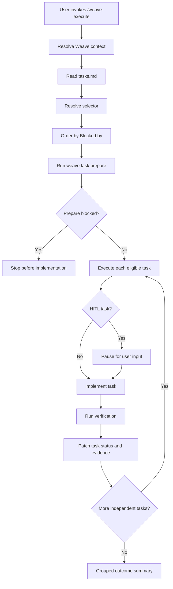

# Task Execution Workflow Architecture

## Decision Summary

- Add `/weave-execute` as a bundled agent skill and opencode slash command wrapper.
- Do not add `weave task execute` in v1.
- Do not add a narrow task status/evidence update CLI or helper library in v1.
- Reuse the existing deterministic `weave task prepare ... --json` command as the branch-readiness gate before implementation.
- Keep implementation, dependency reasoning, HITL pauses, verification, and `tasks.md` updates inside the skill workflow.
- Store durable execution evidence only in the affected `tasks.md` task entries.
- Package and test `/weave-execute` through the same skill/template/install path used by existing Weave skills.
- Bundle a tactical `weave-architect` skill compliance fix into this change as an explicit scope expansion. The `weave-architect` discovery sequence currently allows Plan Mode agents to skip `weave artifact current set architecture --json`; restructure it to mirror `weave-explore`. Designed in `architecture/weave-architect-lane-commit.md`.

## System Context

- Product contract: `wiki/changes/260607-bbam-task-execution-workflow/prd.md`.
- Current task artifact shape is defined by `templates/skills/weave-issues/SKILL.md`.
- Existing task parsing for prepare lives in `src/lib/tasks.ts`.
- Existing prepare orchestration lives in `src/lib/task-prepare.ts`.
- Existing task CLI registration lives in `src/commands/task.ts` and `src/cli.ts`.
- Existing skill and opencode command packaging lives in `src/lib/agent-skills.ts`, `templates/skills/*/SKILL.md`, and `templates/opencode/commands/*.md`.
- Existing prepare skill precedent lives in `templates/skills/weave-prepare/SKILL.md` and `templates/opencode/commands/weave-prepare.md`.
- Existing tests covering the relevant surfaces are `tests/tasks.test.ts`, `tests/task-prepare.test.ts`, and `tests/agent-skills.test.ts`.

## Architecture Overview

The v1 execution workflow has one primary layer: the agent skill.

`/weave-execute` should resolve the active Weave change, read `tasks.md`, resolve the user's selector, build a dependency-ordered task queue from `Blocked by:`, run prepare once for the final selected task set, then implement and verify each eligible task.

The skill owns all agent behavior:

- interpreting arguments and no-argument prompts;
- parsing task content beyond what prepare currently needs;
- dependency ordering;
- HITL pauses;
- implementation;
- verification;
- careful `tasks.md` patching;
- grouped final summaries.

The existing prepare CLI remains the deterministic boundary for branch readiness. The execute skill must not duplicate branch-switching logic or hand-edit `status.yml`.



## Skill Workflow

The `weave-execute` skill should:

1. Resolve context with Tier 1 commands and surface any notices.
2. Read the active change's `tasks.md`.
3. Stop with a clear message if `tasks.md` is missing.
4. Map arguments:
   - `all` means all executable `T#` tasks.
   - `T1 T3` means explicit task ids.
   - a single non-task value means scope.
   - no arguments means ask the short selector prompt from the PRD.
5. Parse enough task content to reason about `Status`, `Type`, `Scope`, `Primary repo`, `Repos`, `Blocked by`, acceptance criteria, and verification guidance.
6. Build a dependency-ordered execution queue using `Blocked by:`.
7. Stop on missing dependency ids or dependency cycles.
8. Run `weave task prepare ... --json` for the final task set before implementation.
9. Use `npm run dev -- task prepare ... --json` as the local fallback when the global `weave` command is unavailable.
10. Stop before implementation when prepare reports blockers.
11. For each eligible task, mark it `in_progress`, implement it, run verification, and update task-local evidence.
12. Continue independent later tasks after a failure.
13. Skip downstream tasks whose dependencies failed.
14. Include HITL tasks in `all`, but pause before each HITL task for user input.
15. Finish with a grouped outcome summary.

## Task Artifact Updates

V1 should update `tasks.md` directly from the skill. It should not introduce a task-update CLI or helper library yet.

Allowed task artifact updates:

- active task index status for the affected task;
- detail section `Status:` for the affected task;
- acceptance criteria checkboxes that were actually satisfied;
- concise verification notes under the affected task's `### Verification` section.

The skill must not rewrite unrelated task wording, unrelated task sections, `QF#` entries, `R#` entries, invalid task history, or global task sections unless the selected task's own evidence requires a narrow local note.

Status rules:

- set `in_progress` when work begins for a task;
- set `done` only when implementation is complete and verification passes;
- set `not_tested` when implementation appears complete but verification could not run;
- leave or set `in_progress` with notes when implementation is incomplete or verification fails;
- skip `done` and `invalid` tasks by default.

## Packaging And Install Surface

Add these source templates:

```text
templates/skills/weave-execute/SKILL.md
templates/opencode/commands/weave-execute.md
```

The opencode wrapper should load the skill and pass `$ARGUMENTS`, following the existing wrapper style:

```md
---
description: Execute local Weave tasks for an active change
---

Load and follow the `weave-execute` skill.

Context: $ARGUMENTS
```

If this repo continues checking in installed generated artifacts, add installed copies:

```text
.agents/skills/weave-execute/SKILL.md
.claude/skills/weave-execute/SKILL.md
.opencode/commands/weave-execute.md
```

Update `.weave/agents.yml` through the normal agent install/update flow rather than by hand.

## Facets

- `index.md`: main v1 architecture for the skill-only execution workflow.
- `weave-architect-lane-commit.md`: tactical compliance fix that restructures the `weave-architect` discovery sequence so the architecture lane commit runs reliably in Plan Mode. In-scope as an explicit scope expansion; independent of `/weave-execute`.
- Optional future facet: `task-artifact-updates.md` if direct `tasks.md` patching becomes complex enough to need a separate design.

## Tradeoffs

- Skill-direct `tasks.md` updates keep v1 small and aligned with the agent-first PRD.
- Avoiding `weave task execute` prevents users from confusing deterministic CLI behavior with agent implementation behavior.
- Reusing prepare avoids duplicating branch-readiness and `status.yml.execution` behavior.
- The main cost is that task artifact updates rely on precise skill instructions and patch discipline rather than typed update APIs.
- A future helper CLI or library can still be introduced if skill-direct markdown updates prove noisy, brittle, or hard to test.

## Risks And Mitigations

- Risk: Dependency parsing from prose-like `Blocked by:` values is brittle.
  Mitigation: require clear `T#` ids or `None`; stop on missing ids, unclear blockers, or cycles.
- Risk: The agent overwrites unrelated task text.
  Mitigation: instruct the skill to patch only selected task rows, task `Status:`, satisfied criteria, and task-local verification notes.
- Risk: Branch readiness changes after task selection.
  Mitigation: always run prepare for the final task set immediately before implementation.
- Risk: HITL tasks run unattended.
  Mitigation: include HITL tasks in `all`, but pause before each HITL task for required user input.
- Risk: Verification fails mid-run.
  Mitigation: continue independent tasks, skip dependency-blocked downstream tasks, and summarize unresolved work.
- Risk: The final summary becomes too noisy.
  Mitigation: group outcomes into completed, `not_tested`, failed or still `in_progress`, skipped, blocked, verification, and next steps.

## Test Plan

Add or update tests for:

- bundled `weave-execute` skill metadata and content;
- checked-in installed skill copies matching the template;
- opencode wrapper installation and content;
- manifest expectations for `weave-execute`;
- no accidental Plan Mode Guard on `weave-execute`;
- no lifecycle progress protocol requirement unless the skill itself calls progress;
- skill instructions covering no-argument prompt, selector mapping, prepare invocation, dependency handling, HITL pauses, status rules, verification notes, and final summary;
- restructured `weave-architect` `# Resolve Context` block: assert the inlined four-command discovery sequence, the new clarifying sentence, and the absence of the old "After the active change is resolved, run:" prose. See `architecture/weave-architect-lane-commit.md` for the full assertion list.

No new CLI tests are required for `weave task execute` because v1 intentionally does not add that command.

## Files Affected

`/weave-execute` work:

- `templates/skills/weave-execute/SKILL.md`: new execution skill.
- `templates/opencode/commands/weave-execute.md`: new opencode wrapper.
- `.agents/skills/weave-execute/SKILL.md`: installed copy when generated artifacts are checked in.
- `.claude/skills/weave-execute/SKILL.md`: installed copy when generated artifacts are checked in.
- `.opencode/commands/weave-execute.md`: installed opencode wrapper when generated artifacts are checked in.
- `.weave/agents.yml`: updated by the normal agent install/update flow.
- `tests/agent-skills.test.ts`: packaging, installed-copy, and manifest assertions.
- `wiki/knowledge/domains/change-workflow/features/weave-execute/behavior.md`: current-state knowledge after implementation.
- `wiki/knowledge/domains/change-workflow/index.md`: feature index update after implementation.

`weave-architect` lane-commit fix (see `architecture/weave-architect-lane-commit.md`):

- `templates/skills/weave-architect/SKILL.md`: restructured `# Resolve Context` with inlined lane commit and clarifying sentence.
- `.agents/skills/weave-architect/SKILL.md`: byte-identical sync.
- `.claude/skills/weave-architect/SKILL.md`: byte-identical sync.
- `tests/agent-skills.test.ts`: extended assertions for the inlined block, the clarifying sentence, and the absence of the old separated-block prose.
- `wiki/knowledge/domains/change-workflow/features/weave-architect/behavior.md`: updated Current Behavior plus a 2026-06-07 Change History entry.

## Open Questions

- Whether the PRD should be amended to record the `weave-architect` lane-commit fix as a product behavior expansion. The current PRD scopes the change to `/weave-execute` only. Reported as a follow-up artifact; not blocking architecture.

## Revision History

- 2026-06-07T11:04:14Z: Initial architecture for `/weave-execute` v1 captured by `weave-capture`.
- 2026-06-07T11:14:00Z: Scope expansion via `weave-clarify architecture` - added `weave-architect-lane-commit.md` facet covering the Plan Mode lane-commit compliance fix; updated decision summary, facets, files affected, test plan, and open questions accordingly.

## Capture Guidance

This architecture is captured in folder mode at `architecture/index.md` plus the `architecture/weave-architect-lane-commit.md` facet. The next workflow step is `weave-issues` to create local implementation tasks; the issues skill should produce vertical slices for both the `/weave-execute` work and the `weave-architect` lane-commit fix.
