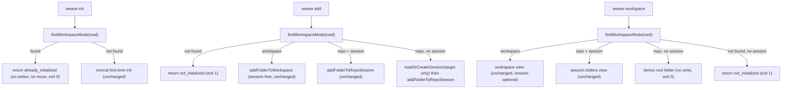

# Fix Init: Cloned Weave Workspaces Should Just Work Architecture

## Decision Summary

- **D1 — `weave init` is a safe no-op when already initialized.** A top-of-function walk-up via `findWorkspaceMode(cwd)` in `initWorkspace()` ([src/lib/init-workspace.ts](src/lib/init-workspace.ts)) short-circuits before any prompt or generation when a valid `.weave/workspace.yml` exists in the tree. It returns a new `already_initialized` status and the message `Weave is already initialized (mode: <repo|workspace>). Start a new change with \`weave change new "<title>"\`.` This makes the destructive workspace-mode adoption path (`initWorkspaceFromGitRepo`, which moves the cloned repo) syntactically unreachable for any already-initialized tree.
- **D2 — Repo-mode `weave workspace` derives without writing.** `buildRepoModeResult` in [src/lib/show-workspace.ts](src/lib/show-workspace.ts) no longer errors when the session is absent. It derives a single folder from the workspace root and returns `status: "ok"`, exit 0, without writing a session file. This preserves the documented read-only contract of `weave workspace`.
- **D3 — Rename `no_session` -> `not_initialized`.** The public JSON status is renamed across types, returns, command-wrapper exit checks, tests, and docs. The renamed status is emitted only in the genuine uninitialized case (no `workspace.yml` anywhere up the tree, no session). No in-repo JSON consumer branches on the string.
- **D4 — `weave add` lazily creates a repo-mode session (target only).** `addFolder` in [src/lib/add-folder.ts](src/lib/add-folder.ts) dispatches on `findWorkspaceMode(cwd)` first. In repo mode with no session, a new `loadOrCreateSession(folder, now, sessionPath)` helper in [src/lib/session-state.ts](src/lib/session-state.ts) creates a session containing only the target folder, then proceeds. The workspace-root repo is not auto-added.
- **D5 — `weave change *` and `weave doctor` unchanged.** `resolveChangeContext` in [src/lib/workspace-mode.ts](src/lib/workspace-mode.ts) already works from `workspace.yml` + branch; `weave doctor` already gates on `findWorkspaceMode`. No changes needed.

## System Context

- **Committed state (survives `git clone`):** `.weave/workspace.yml` (mode, workspace name, registered repos) plus the `wiki/` and `.weave/` scaffold.
- **Machine-local state (never committed):** `~/.cache/weave/current-session.yml` holding `folders` (repo-mode scope) and `current_change`/`current_artifact` fields that are defined but never read.
- **Active change derivation:** from the git branch (`change/<id>`) in `currentContextForTarget` ([src/lib/changes.ts](src/lib/changes.ts)), not from the session.
- **Mode detection:** `findWorkspaceMode(cwd)` in [src/lib/workspace-mode.ts](src/lib/workspace-mode.ts) walks up from cwd looking for `.weave/workspace.yml` and reads `mode`. Shared by `weave add`, `weave workspace`, `weave change *`, and `weave doctor`. A malformed yml is treated as absent.
- **Repo context:** single repo `weave-it` (the CLI itself), repo mode. No sub-repos.

## Architecture Overview

The session is demoted from a prerequisite to an optional, lazily-created cache. The committed `.weave/workspace.yml` plus cwd plus the git branch become the sole source of truth for initialization and command context.

### `weave init` flow

1. `findWorkspaceMode(cwd)` walk-up.
2. If a valid workspace is found, return `already_initialized` (exit 0). No scaffold, no `git init`, no repo move, no session write/replace. The `shouldReplaceSession` prompt is skipped entirely.
3. Otherwise, run the normal first-time init flow (repo or workspace mode), unchanged. The `shouldReplaceSession` prompt still fires for genuine first-time init when a session exists from a different folder.

### `weave add` flow

1. `findWorkspaceMode(cwd)` first.
2. Undefined -> return `not_initialized` (exit 1).
3. Workspace mode -> `addFolderToWorkspace` (session-free, unchanged).
4. Repo mode + session -> `addFolderToRepoSession` (unchanged).
5. Repo mode, no session -> `loadOrCreateSession(target only)` then `addFolderToRepoSession`.

### `weave workspace` flow

1. `findWorkspaceMode(cwd)` first.
2. Workspace mode -> workspace view (session optional, unchanged).
3. Repo mode + session -> `session.folders` view (unchanged).
4. Repo mode, no session -> derive the root folder from `workspacePath` (no write, exit 0).
5. Not found, no session -> `not_initialized` (exit 1).

## Facets

- `index.md`: this file. Canonical entry point and decision summary.
- `command-flow` (proposed, not yet split): the per-command dispatch tables and lazy-session semantics described above. Can be split into `architecture/command-flow.md` later via `weave-clarify architecture` if the index grows.
- `state-model` (proposed, not yet split): the committed-vs-machine-local state split and what each is authoritative for. Can be split into `architecture/state-model.md` later.

## Tradeoffs

- **Top-of-function short-circuit (D1):** simplest and safest. The `shouldReplaceSession` prompt no longer fires for already-initialized trees, which is correct since there is nothing to replace. Genuine first-time init with an existing session still prompts, unchanged.
- **Derive-only `weave workspace` (D2):** preserves the read-only contract. Cost: the session cache is created only by `weave add`, so a user who only ever runs `weave workspace` never gets a session file. Acceptable, since nothing reads it for display anymore in the no-session case.
- **Rename `no_session` -> `not_initialized` (D3):** clean semantics, minor churn in tests/docs. External JSON consumers (if any) would see a new string. Mitigated by the fact that the exit code (1) and message are unchanged in the genuine case.
- **Lazy session with target only (D4):** `weave workspace` after a lazy add shows only the added folder, not the workspace root. This differs from `weave init && weave add <target>` (which would show both). Acceptable: the user explicitly did not init, and the workspace root is always derivable from `workspace.yml`.

## Risks And Open Questions

- **Risk: future regression re-enables the destructive adoption path.** Mitigation: the top-of-function short-circuit makes `initWorkspaceFromGitRepo` syntactically unreachable for already-initialized trees. A defensive assertion inside `initWorkspaceFromGitRepo` was considered and deferred.
- **Risk: malformed `workspace.yml` treated as absent -> `weave init` re-runs destructively.** This is existing behavior (`findWorkspaceMode` returns undefined on parse failure). Left as-is for V1; a follow-up could warn. Out of scope.
- **Risk: lazy session creation surprises automation by writing a file on `weave add`.** Mitigation: `weave add` is already a write command (it writes `workspace.yml`/session), so writing a session file is consistent with its contract. `weave workspace` (the read command) stays read-only.
- **Risk: renaming `no_session` breaks an external JSON consumer.** Mitigation: no in-repo consumer branches on the string; exit code and message are preserved. Document the rename in the changelog.

Open questions: none. All architecture decisions are resolved.
